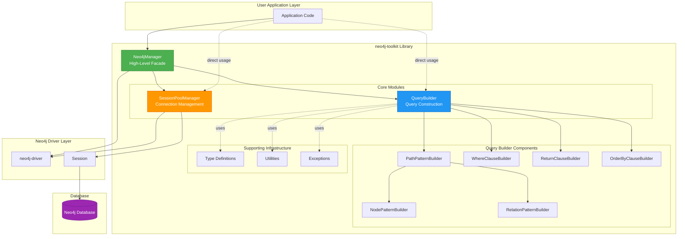
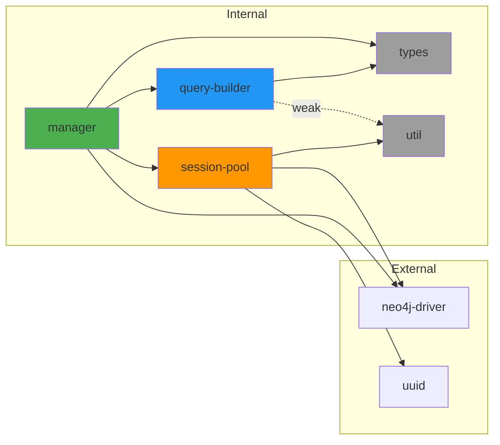
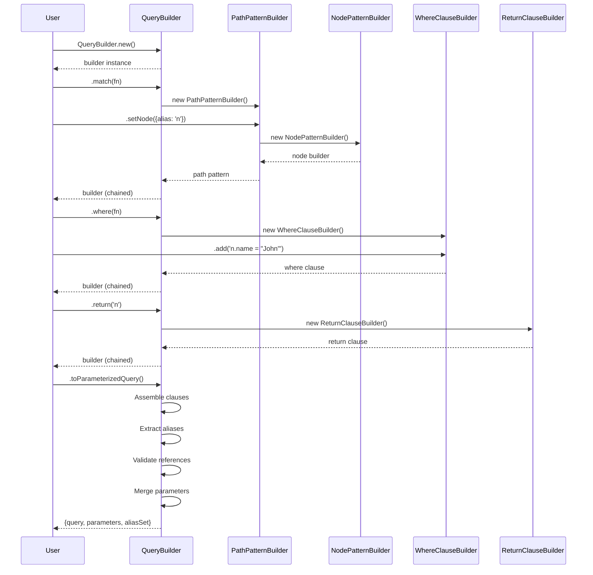
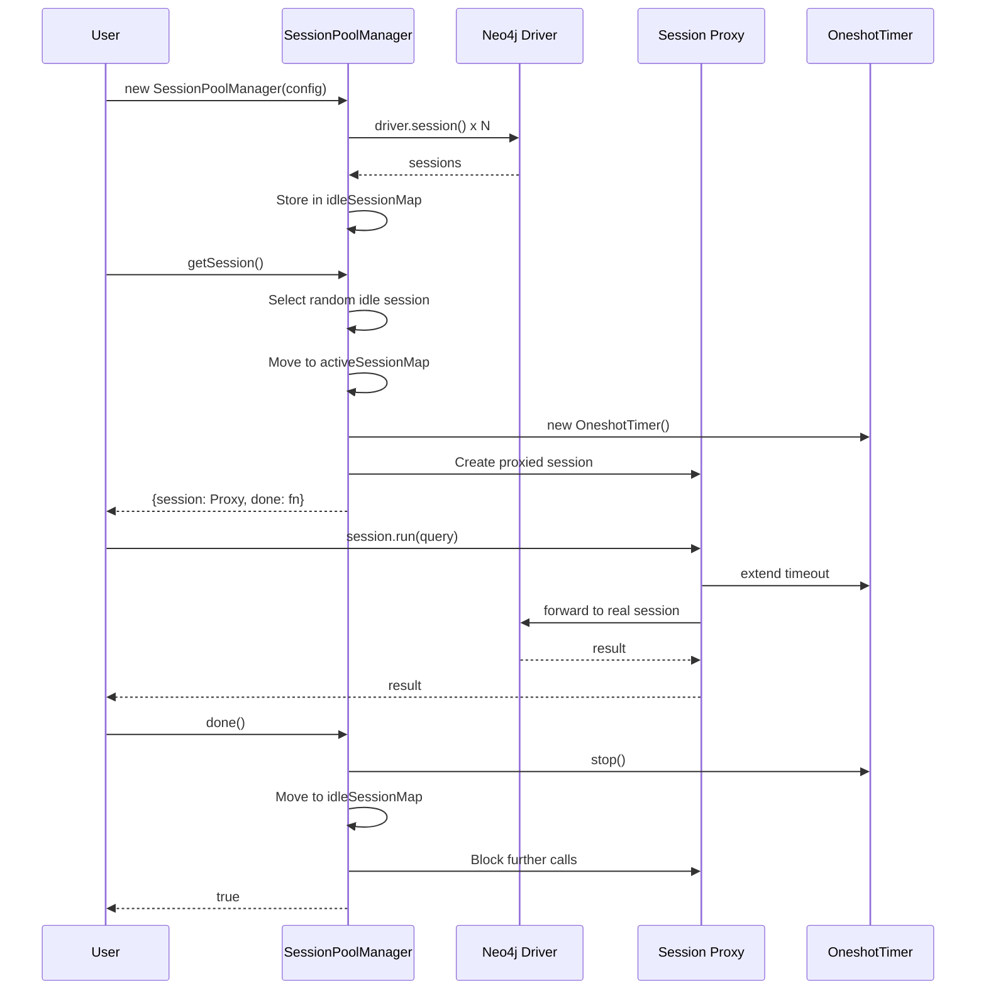
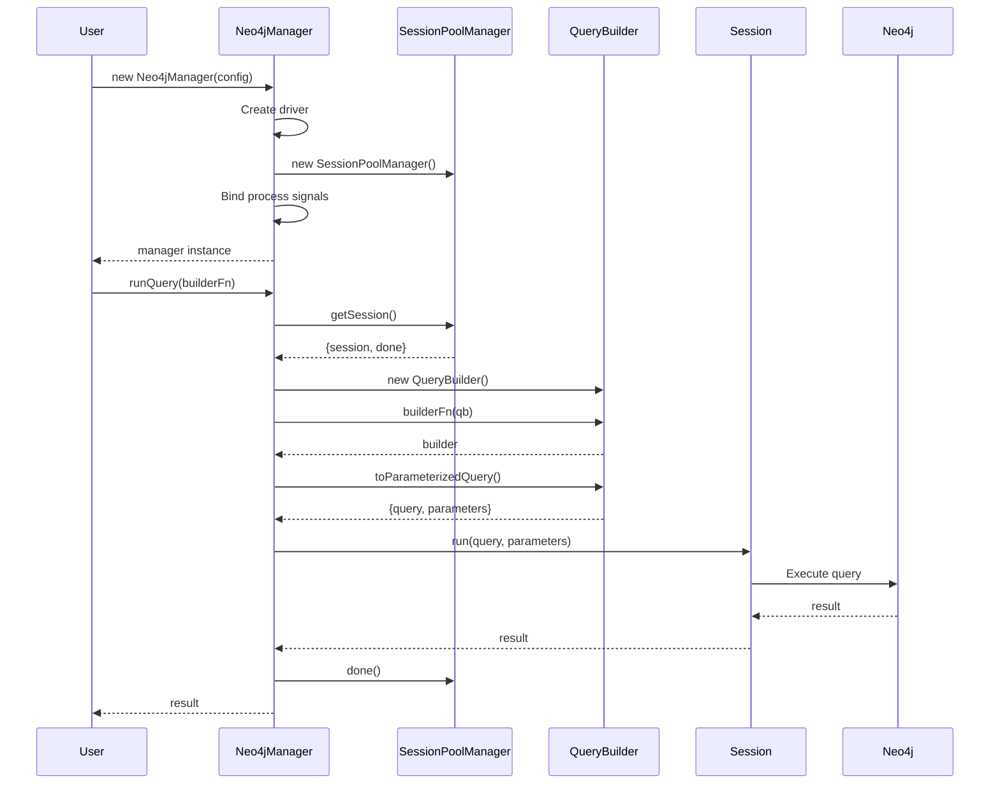

# Architecture Overview

## Table of Contents

1. [Introduction](#introduction)
2. [High-Level Architecture](#high-level-architecture)
3. [Module Structure](#module-structure)
4. [Layer Architecture](#layer-architecture)
5. [Data Flow](#data-flow)
6. [Component Relationships](#component-relationships)

---

## Introduction

The **neo4j-toolkit** is a TypeScript library designed to provide a fluent, type-safe interface for building and executing Neo4j Cypher queries. The library is organized around three core modules that work together to provide a comprehensive solution for Neo4j interaction:

- **Query Builder**: Programmatic Cypher query construction
- **Session Pool**: Efficient connection management
- **Manager**: High-level integration facade

### Design Goals

```
┌─────────────────────────────────────────────────────────────┐
│                     Design Goals                            │
├─────────────────────────────────────────────────────────────┤
│                                                             │
│  ✓ Type Safety         → Catch errors at compile time      │
│  ✓ Fluent API          → Intuitive, chainable methods      │
│  ✓ Modularity          → Use components independently       │
│  ✓ Performance         → Connection pooling & reuse        │
│  ✓ Developer Experience → Clear error messages            │
│  ✓ Composability       → Build complex from simple         │
│                                                             │
└─────────────────────────────────────────────────────────────┘
```

---

## High-Level Architecture



### Architecture Layers

The library is organized into distinct layers, each with specific responsibilities:

```
╔═══════════════════════════════════════════════════════════════╗
║                    Layer 1: Facade                            ║
║  ┌───────────────────────────────────────────────────────┐   ║
║  │ Neo4jManager                                          │   ║
║  │ - Unified interface                                   │   ║
║  │ - Process lifecycle management                        │   ║
║  │ - Query execution orchestration                       │   ║
║  └───────────────────────────────────────────────────────┘   ║
╠═══════════════════════════════════════════════════════════════╣
║                 Layer 2: Core Subsystems                      ║
║  ┌──────────────────────────┐  ┌────────────────────────┐   ║
║  │ QueryBuilder             │  │ SessionPoolManager     │   ║
║  │ - Query construction     │  │ - Connection pooling   │   ║
║  │ - Clause orchestration   │  │ - Session lifecycle    │   ║
║  │ - Parameterization       │  │ - Idle timeout mgmt    │   ║
║  └──────────────────────────┘  └────────────────────────┘   ║
╠═══════════════════════════════════════════════════════════════╣
║                Layer 3: Query Components                      ║
║  ┌──────────────┐ ┌──────────────┐ ┌──────────────────┐     ║
║  │ Path Pattern │ │ Clause       │ │ Component        │     ║
║  │ Builder      │ │ Builders     │ │ Builders         │     ║
║  │              │ │ - WHERE      │ │ - Node           │     ║
║  │              │ │ - RETURN     │ │ - Relationship   │     ║
║  │              │ │ - ORDER BY   │ │                  │     ║
║  └──────────────┘ └──────────────┘ └──────────────────┘     ║
╠═══════════════════════════════════════════════════════════════╣
║               Layer 4: Building Blocks                        ║
║  ┌──────────────┐ ┌──────────────┐ ┌──────────────────┐     ║
║  │ CommonBuilder│ │ IQueryBuilder│ │ Utilities        │     ║
║  │ - Shared     │ │ - Interface  │ │ - Param replace  │     ║
║  │   logic      │ │   contract   │ │ - Alias extract  │     ║
║  └──────────────┘ └──────────────┘ └──────────────────┘     ║
╠═══════════════════════════════════════════════════════════════╣
║                  Layer 5: Type System                         ║
║  ┌───────────────────────────────────────────────────────┐   ║
║  │ - Neo4jPrimitive                                      │   ║
║  │ - Neo4jProperties                                     │   ║
║  │ - ParameterizedQuery                                  │   ║
║  │ - Constructor Types                                   │   ║
║  └───────────────────────────────────────────────────────┘   ║
╚═══════════════════════════════════════════════════════════════╝
```

---

## Module Structure

### Directory Organization

```
neo4j-toolkit/
│
├── src/
│   ├── index.ts                    # Main entry point
│   │
│   ├── query-builder/              # Query Builder Module
│   │   ├── query-builder.ts        # Main orchestrator
│   │   ├── path-pattern-builder.ts # Path pattern construction
│   │   ├── type.ts                 # Type definitions
│   │   ├── util.ts                 # Utilities
│   │   ├── exception.ts            # Custom exceptions
│   │   │
│   │   ├── component/              # Graph element builders
│   │   │   ├── base-builder.ts     # Common functionality
│   │   │   ├── node-builder.ts     # Node patterns
│   │   │   └── relation-builder.ts # Relationship patterns
│   │   │
│   │   └── clause/                 # Cypher clause builders
│   │       ├── select-clause-builder.ts  # MATCH/CREATE/MERGE
│   │       ├── where-clause-builder.ts   # WHERE conditions
│   │       ├── return-clause-builder.ts  # RETURN projection
│   │       ├── order-by-clause-builder.ts # ORDER BY sorting
│   │       └── set-clause-builder.ts     # SET operations
│   │
│   ├── session-pool/               # Session Pool Module
│   │   ├── manager.ts              # Pool manager
│   │   └── exception.ts            # Pool exceptions
│   │
│   ├── manager/                    # Manager Module
│   │   └── manager.ts              # High-level facade
│   │
│   ├── types/                      # Shared Types
│   │   ├── basic.ts                # Neo4j primitives
│   │   └── index.ts                # Type exports
│   │
│   └── util/                       # General Utilities
│       └── timeout.ts              # Oneshot timer
│
├── package.json
├── tsconfig.json
└── README.md
```

### Module Dependencies



**Dependency Rules:**
- No circular dependencies between modules
- `types/` has no dependencies (pure type definitions)
- `util/` has minimal dependencies
- `manager/` depends on all core modules (facade pattern)
- `query-builder/` is independent of `session-pool/`

---

## Layer Architecture

### Separation of Concerns

```
┌─────────────────────────────────────────────────────────────┐
│                   Presentation Layer                        │
│  ┌─────────────────────────────────────────────────────┐   │
│  │  Fluent API Surface                                 │   │
│  │  - Method chaining                                  │   │
│  │  - Type-safe interfaces                             │   │
│  │  - Overloaded methods for flexibility               │   │
│  └─────────────────────────────────────────────────────┘   │
└─────────────────────────────────────────────────────────────┘
                           ↓
┌─────────────────────────────────────────────────────────────┐
│                   Business Logic Layer                      │
│  ┌─────────────────────────────────────────────────────┐   │
│  │  Query Construction Logic                           │   │
│  │  - Builder pattern implementation                   │   │
│  │  - Clause composition                               │   │
│  │  - Alias tracking & validation                      │   │
│  │                                                      │   │
│  │  Session Management Logic                           │   │
│  │  - Pool allocation strategy                         │   │
│  │  - Lifecycle management                             │   │
│  │  - Timeout handling                                 │   │
│  └─────────────────────────────────────────────────────┘   │
└─────────────────────────────────────────────────────────────┘
                           ↓
┌─────────────────────────────────────────────────────────────┐
│                  Data Generation Layer                      │
│  ┌─────────────────────────────────────────────────────┐   │
│  │  Query String Generation                            │   │
│  │  - Cypher syntax construction                       │   │
│  │  - Parameter extraction                             │   │
│  │  - Parameterized query generation                   │   │
│  └─────────────────────────────────────────────────────┘   │
└─────────────────────────────────────────────────────────────┘
                           ↓
┌─────────────────────────────────────────────────────────────┐
│                  Infrastructure Layer                       │
│  ┌─────────────────────────────────────────────────────┐   │
│  │  Neo4j Driver Integration                           │   │
│  │  - Session creation                                 │   │
│  │  - Query execution                                  │   │
│  │  - Result handling                                  │   │
│  └─────────────────────────────────────────────────────┘   │
└─────────────────────────────────────────────────────────────┘
```

---

## Data Flow

### Query Building Flow



### Session Pool Flow



### Manager Integration Flow



---

## Component Relationships

### Builder Pattern Hierarchy

```
                    IQueryBuilder
                         ↑
          ┌──────────────┼──────────────┐
          │              │              │
    CommonBuilder   PathPatternBuilder  QueryBuilder
          ↑              │              │
    ┌─────┴─────┐        │              │
    │           │        │              │
NodePattern  RelationPattern           │
  Builder       Builder                │
                                       │
                    ┌──────────────────┼──────────────────┐
                    │                  │                  │
              ClauseBuilders    PathPatternCommon   WhereClauseBuilder
                    │           ClauseBuilder            │
                    │                  │                 │
            ┌───────┼────────┐         ↑                 │
            │       │        │    ┌────┴────┐            │
        Return  OrderBy   Set    │    │    │   │       ┌──────┐
        Clause  Clause   Clause  │    │    │   │       │ Tree │
        Builder Builder  Builder  │    │    │   │       │ Node │
                               Match Create Merge Optional  │
                               Clause Clause Clause  Match   └──────┘
                               Builder Builder Builder Clause
                                                      Builder
```

### Composition Relationships

```
QueryBuilder
    │
    ├── Map<ComponentType, ComponentNode>
    │    │
    │    ├── MATCH → MatchClauseBuilder
    │    │            └── PathPatternBuilder[]
    │    │                 └── GraphElement (linked list)
    │    │                      ├── NodePatternBuilder
    │    │                      └── RelationPatternBuilder
    │    │
    │    ├── WHERE → WhereClauseBuilder
    │    │            └── WhereNode (tree)
    │    │                 ├── statement
    │    │                 ├── and
    │    │                 ├── or
    │    │                 └── bracket → WhereNode[]
    │    │
    │    ├── RETURN → ReturnClauseBuilder
    │    │             └── statements[]
    │    │
    │    ├── ORDER BY → OrderByClauseBuilder
    │    │               └── orderByList[]
    │    │
    │    ├── SKIP/LIMIT/OFFSET → number
    │    │
    │    └── FINISH → marker
    │
    └── aliasSet: Set<string>
```

### Session Pool Structure

```
SessionPoolManager
    │
    ├── _neo4jDriver: Driver
    │
    ├── _idleSessionMap: Map<UUID, Session>
    │    └── Available sessions waiting for allocation
    │
    ├── _activeSessionMap: Map<UUID, Session>
    │    └── Currently in-use sessions
    │
    └── Configuration
         ├── _numOfSessions: number
         └── _idleTimeoutMs?: number


Session Proxy Wrapper
    │
    ├── target: Session (real Neo4j session)
    │
    ├── callback: () => void
    │    └── Extends idle timeout on method call
    │
    ├── blockStatus: () => boolean
    │    └── Checks if session is still active
    │
    └── OneshotTimer
         ├── Tracks idle time
         ├── Auto-extends on activity
         └── Returns session on timeout
```

---

## Design Patterns Summary

| Pattern | Component | Purpose |
|---------|-----------|---------|
| **Builder** | QueryBuilder, PathPatternBuilder, All Clause Builders | Progressive construction of complex objects |
| **Facade** | Neo4jManager | Simplified interface to complex subsystems |
| **Composite** | PathPatternBuilder (graph elements), WhereClauseBuilder (tree) | Tree-like structures for nested components |
| **Proxy** | Session Proxy | Control access, extend timeouts, block stale sessions |
| **Object Pool** | SessionPoolManager | Reuse expensive resources (sessions) |
| **Strategy** | Clause Builders (Match, Create, Merge, etc.) | Different implementations of same interface |
| **Factory** | Static `.new()` methods | Standardized object creation |
| **Chain of Responsibility** | Clause assembly in QueryBuilder | Sequential processing of clauses |

---

## Key Architectural Decisions

### 1. **Immutable Builder Pattern**
Builders appear immutable from the outside (method chaining), but use internal mutation for performance.

```typescript
// External: appears immutable
const query = QueryBuilder.new()
    .match(...)  // returns this
    .where(...)  // returns this
    .return(...) // returns this

// Internal: mutates _componentNodeMap
```

### 2. **Alias Tracking System**
Selective clauses (MATCH, CREATE, MERGE) populate the alias set, which is then validated by dependent clauses (WHERE, RETURN).

```
MATCH (n:Person)-[r:KNOWS]->(m:Person)
         ↓          ↓           ↓
    Aliases: {n, r, m}
                 ↓
WHERE n.age > 25 ← validates 'n' exists
         ↓
RETURN n, m ← validates 'n', 'm' exist
```

### 3. **Component Map (not List)**
Query components are stored in a Map by type, ensuring only one of each type exists (except for selective clauses which aggregate).

### 4. **Ghost Node Injection**
PathPatternBuilder automatically adds empty nodes when patterns start/end with relationships to ensure valid Cypher.

```
User writes: setRelationship({alias: 'r'}).toNode({alias: 'n'})
Generated:   ()-[r]->(n)
                ↑ ghost node automatically added
```

### 5. **Progressive Complexity**
Users can choose their level of abstraction:
- Low-level: `QueryBuilder` only
- Mid-level: `QueryBuilder` + `SessionPoolManager`
- High-level: `Neo4jManager` (all-in-one)

---

## Next Steps

- [Design Philosophy →](./02-design-philosophy.md)
- [Query Builder Deep Dive →](./03-query-builder.md)
- [Session Pool Deep Dive →](./04-session-pool.md)
- [Manager Integration →](./05-manager.md)
