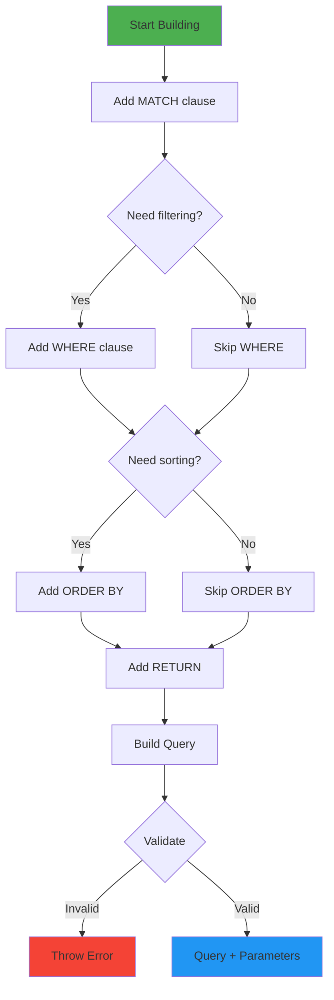
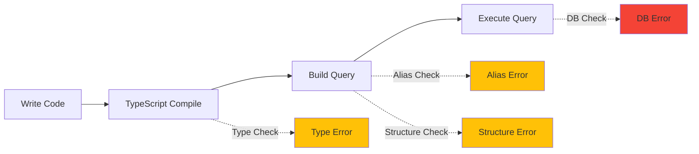

# Design Philosophy & Principles

## Table of Contents

1. [Core Philosophy](#core-philosophy)
2. [Design Principles](#design-principles)
3. [Type System Philosophy](#type-system-philosophy)
4. [Error Handling Philosophy](#error-handling-philosophy)
5. [Performance Philosophy](#performance-philosophy)
6. [API Design Philosophy](#api-design-philosophy)

---

## Core Philosophy

### The Three Pillars

```
┌─────────────────────────────────────────────────────────────┐
│                                                             │
│         ╔═══════════════════════════════════════╗          │
│         ║    TYPE SAFETY                        ║          │
│         ║    Catch errors at compile time       ║          │
│         ╚═══════════════════════════════════════╝          │
│                         ▲                                   │
│                         │                                   │
│          ┌──────────────┼──────────────┐                   │
│          │                             │                   │
│          │                             │                   │
│  ╔═══════▼═══════╗            ╔════════▼═══════╗           │
│  ║   DEVELOPER   ║            ║   PERFORMANCE  ║           │
│  ║   EXPERIENCE  ║◄──────────►║   EFFICIENCY   ║           │
│  ║   Intuitive   ║            ║   Optimized    ║           │
│  ╚═══════════════╝            ╚════════════════╝           │
│                                                             │
│  Where these pillars intersect, we find the sweet spot     │
│  for library design: safe, fast, and delightful to use.    │
│                                                             │
└─────────────────────────────────────────────────────────────┘
```

### Philosophy Statement

> "Build complex queries from simple, composable parts. Fail fast during construction, not during execution. Make the right way the easy way."

**What this means:**

1. **Composability**: Small, focused builders combine to create complex queries
2. **Fail-Fast**: Validation happens at build time, not query execution time
3. **Ergonomics**: The fluent API guides users towards correct usage

---

## Design Principles

### 1. Builder Pattern Everywhere

**Principle**: Use the builder pattern for progressive construction of complex objects.

```
Traditional Approach (String Concatenation):
══════════════════════════════════════════════
  ❌ Prone to syntax errors
  ❌ No type safety
  ❌ Hard to maintain
  ❌ Parameters mixed with query logic

  const query = `MATCH (n:Person {name: "${name}"}) RETURN n`;
       └─── Vulnerable to injection
       └─── No compile-time validation


Builder Approach (neo4j-toolkit):
══════════════════════════════════════════════
  ✅ Type-safe construction
  ✅ Automatic parameterization
  ✅ Fluent, readable API
  ✅ Compile-time validation

  const query = QueryBuilder.new()
    .match(p => p.setNode({
      alias: 'n',
      labels: ['Person'],
      properties: { name }
    }))
    .return('n')
    .toParameterizedQuery();
       └─── Returns: { query, parameters }
       └─── Safe from injection
       └─── Validated at build time
```

**Why Builder Pattern?**



The builder pattern allows:
- **Progressive disclosure**: Only show relevant methods at each step
- **Compile-time validation**: TypeScript enforces correct method chains
- **Immutability illusion**: Appears immutable but uses efficient internal mutation

### 2. Separation of Concerns

**Principle**: Each module has one clear responsibility.

```
┌───────────────────────────────────────────────────────────┐
│  Module                   Responsibility                  │
├───────────────────────────────────────────────────────────┤
│                                                           │
│  QueryBuilder            Cypher query construction       │
│    ├─ What it does       ✓ Build query strings           │
│    │                     ✓ Manage parameters             │
│    │                     ✓ Validate structure            │
│    └─ What it DOESN'T    ✗ Execute queries               │
│                          ✗ Manage connections            │
│                          ✗ Handle results                │
│                                                           │
│  SessionPoolManager      Connection lifecycle            │
│    ├─ What it does       ✓ Pool sessions                 │
│    │                     ✓ Track usage                   │
│    │                     ✓ Timeout management            │
│    └─ What it DOESN'T    ✗ Build queries                 │
│                          ✗ Parse results                 │
│                          ✗ Business logic                │
│                                                           │
│  Neo4jManager            Integration & convenience       │
│    ├─ What it does       ✓ Coordinate components         │
│    │                     ✓ Execute queries               │
│    │                     ✓ Manage lifecycle              │
│    └─ What it DOESN'T    ✗ Query construction details    │
│                          ✗ Pool implementation           │
│                                                           │
└───────────────────────────────────────────────────────────┘
```

**Benefits:**
- Can use `QueryBuilder` without `SessionPoolManager`
- Can swap implementations independently
- Easier to test each module in isolation
- Clear mental model for users

### 3. Fail-Fast Validation

**Principle**: Catch errors as early as possible in the development lifecycle.

```
Development Lifecycle Error Detection:
════════════════════════════════════════════════════════════

┌─────────────┐  ┌─────────────┐  ┌─────────────┐  ┌─────────────┐
│   Write     │  │   Compile   │  │   Build     │  │   Runtime   │
│   Code      │  │   (tsc)     │  │   Query     │  │   Execute   │
└──────┬──────┘  └──────┬──────┘  └──────┬──────┘  └──────┬──────┘
       │                │                │                │
       │                │                │                │
   Type Errors      Type Errors     Structure       Database
   detected here    caught here     Errors          Errors
       ▲                ▲           caught here         ▲
       │                │                ▲              │
       └────────────────┴────────────────┴──────────────┘
                  Earlier is Better!

Example:

❌ Late Error (Runtime):
   MATCH (n:Person)
   WHERE m.age > 25    ← 'm' not defined
   RETURN n

   Error: Variable `m` not defined
   (Caught during query execution in database)

✅ Early Error (Build Time):
   QueryBuilder.new()
     .match(p => p.setNode({ alias: 'n' }))
     .where(w => w.add('m.age > 25'))
     //              ▲ 'm' not in alias set
     .toParameterizedQuery()

   Error: Alias 'm' not found in selected components
   (Caught during .toParameterizedQuery() call)
```

**Validation Checkpoints:**



**What we validate at build time:**
- Alias existence in WHERE/RETURN clauses
- Query structure (can't have both RETURN and FINISH)
- Component uniqueness (only one WHERE clause)
- Graph pattern validity (no dangling relationships)

### 4. Fluent API Design

**Principle**: Method chaining creates a natural, readable flow.

```
Code reads like English:
════════════════════════════════════════════════════════════

QueryBuilder.new()
  .match(p => p
    .setNode({ alias: 'person', labels: ['Person'] })
    .toRelationship({ alias: 'knows', label: 'KNOWS' })
    .toNode({ alias: 'friend', labels: ['Person'] })
  )
  .where(w => w
    .add('person.age > 25')
    .and('friend.age > 25')
  )
  .return('person', 'friend')
  .orderBy('person.name', 'ASC')
  .limit(10)

Reads as:
  "Match a person who knows a friend,
   where both are over 25,
   return person and friend,
   ordered by person's name,
   limited to 10 results"
```

**Fluent API Characteristics:**

| Characteristic | Implementation | Benefit |
|---------------|----------------|---------|
| **Method Chaining** | All methods return `this` | Natural flow |
| **Progressive Disclosure** | Methods appear when relevant | Reduced cognitive load |
| **Self-Documenting** | Method names describe intent | Less need for docs |
| **Type-Guided** | TypeScript autocomplete guides usage | Discovery through IDE |

### 5. Explicit Over Implicit

**Principle**: Make behavior obvious; avoid magic.

```
Examples of Explicitness:
════════════════════════════════════════════════════════════

✅ EXPLICIT: Ghost node with warning
   User writes:
     setRelationship({ alias: 'r' }).toNode({ alias: 'n' })

   Library behavior:
     - Adds ghost node: ()-[r]->(n)
     - Prints warning to console
     - User is informed of the transformation

✅ EXPLICIT: Done callback for session return
   const { session, done } = pool.getSession();
   // ... use session ...
   done();  ← Explicit return to pool

   (Not automatic/implicit cleanup)

✅ EXPLICIT: Parameterized query generation
   builder.toParameterizedQuery()  ← Explicit method call
   builder.toRawQuery()            ← Different method for raw

   (Not automatic string conversion)

❌ IMPLICIT would be:
   - Automatic session cleanup (hard to reason about)
   - toString() automatically parameterizing (confusing)
   - Silent query modifications (surprising behavior)
```

### 6. Composition Over Inheritance

**Principle**: Build complex behavior by combining simple parts.

```
Inheritance Hierarchy (Minimal):
═════════════════════════════════════════════════════════════
                    IQueryBuilder
                         ↑
                   CommonBuilder
                    ↑        ↑
                    │        │
              NodePattern  RelationPattern

Only 3 levels deep!


Composition Structure (Primary):
═════════════════════════════════════════════════════════════
QueryBuilder
    │
    ├── HAS-A Map<ComponentType, Component>
    │    ├── MATCH → MatchClauseBuilder
    │    │            └── HAS-MANY PathPatternBuilder
    │    │                 └── HAS-MANY GraphElement
    │    │                      ├── NodePatternBuilder
    │    │                      └── RelationPatternBuilder
    │    │
    │    ├── WHERE → WhereClauseBuilder
    │    │            └── HAS-A tree of WhereNode
    │    │
    │    └── RETURN → ReturnClauseBuilder
    │                  └── HAS-MANY statements
    │
    └── HAS-A Set<string> (alias tracking)


Benefits:
  ✓ More flexible than inheritance
  ✓ Easier to test (inject mock components)
  ✓ Can swap implementations
  ✓ Clearer ownership of responsibility
```

---

## Type System Philosophy

### Strong Typing Everywhere

```typescript
// Discriminated Unions for Query Components
type QueryComponentNode =
  | { type: "MATCH"; builder: MatchClauseBuilder }
  | { type: "WHERE"; builder: WhereClauseBuilder }
  | { type: "RETURN"; builder: ReturnClauseBuilder }
  // TypeScript knows which builder based on type!

// Type-Safe Properties
type Neo4jPrimitive =
  | string
  | number
  | boolean
  | (string | number | boolean)[]
  | null
  | undefined
  | (() => string);  // For function expressions

type Neo4jProperties = Record<string, Neo4jPrimitive>;

// Parameterized Query Structure
type ParameterizedQuery = {
  aliasSet?: Set<string>;
  query: string;
  parameters: Neo4jProperties;
}
```

**Type Safety Guarantees:**

```
┌─────────────────────────────────────────────────────────────┐
│  Compile-Time Guarantees                                    │
├─────────────────────────────────────────────────────────────┤
│                                                             │
│  ✓ Method signatures enforced                              │
│  ✓ Property types validated                                │
│  ✓ Return types guaranteed                                 │
│  ✓ Discriminated unions exhaustively checked               │
│  ✓ Optional parameters explicitly marked                   │
│                                                             │
│  Example:                                                   │
│    const result: ParameterizedQuery =                       │
│      builder.toParameterizedQuery();                        │
│      //    ▲                                                │
│      //    TypeScript guarantees this structure             │
│                                                             │
└─────────────────────────────────────────────────────────────┘
```

---

## Error Handling Philosophy

### Three-Tier Error Strategy

```
┌───────────────────────────────────────────────────────────────┐
│                    Error Severity Levels                      │
├───────────────────────────────────────────────────────────────┤
│                                                               │
│  Level 1: Warnings (console.warn)                            │
│  ────────────────────────────────────────────────────────    │
│  Situations that are handled but noteworthy:                 │
│    • Ghost node injection                                    │
│    • Property/label/alias overwriting                        │
│                                                               │
│  When: Recoverable, but user should know                     │
│                                                               │
│                                                               │
│  Level 2: Build-Time Errors (throw)                          │
│  ────────────────────────────────────────────────────────    │
│  Invalid query structure:                                    │
│    • Missing aliases in WHERE/RETURN                         │
│    • Both RETURN and FINISH present                          │
│    • Empty query construction                                │
│    • Duplicate clause additions                              │
│                                                               │
│  When: Query would be invalid Cypher                         │
│                                                               │
│                                                               │
│  Level 3: Runtime Errors (throw)                             │
│  ────────────────────────────────────────────────────────    │
│  Infrastructure failures:                                    │
│    • No available sessions in pool                           │
│    • Session already returned                                │
│    • Database connection failures                            │
│                                                               │
│  When: External system issues                                │
│                                                               │
└───────────────────────────────────────────────────────────────┘
```

### Custom Exception Hierarchy

```
Error
  ↑
  └── QueryBuilderException
       ├── StartNodeNotSetException
       └── (other query building errors)

  └── SessionPoolException
       ├── NoSessionException
       └── (other pool errors)
```

**Philosophy**: Specific exceptions help users handle different failure modes.

---

## Performance Philosophy

### Optimization Strategy

```
Priority Order:
══════════════════════════════════════════════════════════

1. CORRECTNESS      Always first. Never sacrifice correctness
   ↓                for performance.

2. CLARITY          Code should be understandable. Premature
   ↓                optimization is the root of all evil.

3. EFFICIENCY       Optimize hot paths, reuse resources,
                    avoid unnecessary allocations.


Where We Optimize:
══════════════════════════════════════════════════════════

✅ Session Pooling
   Reuse expensive database connections instead of
   creating new ones for each query.

✅ Parameter Reuse
   Object pooling for parameters to reduce allocations.

✅ String Building
   Use string concatenation instead of template literals
   in hot paths (minimal benefit, but no cost).

✅ Map Over Array
   O(1) lookup for component types instead of O(n) search.


Where We DON'T Optimize:
══════════════════════════════════════════════════════════

❌ Builder Construction
   Creating new builders is not a hot path.
   Clarity > micro-optimization.

❌ Validation Logic
   Fail-fast validation is more important than speed.

❌ Error Messages
   Clear error messages trump terse ones.
```

### Session Pool Efficiency

```
Without Pooling:
══════════════════════════════════════════════════════════
  Request 1: Create Session → Use → Close  ┐
  Request 2: Create Session → Use → Close  ├─ Expensive!
  Request 3: Create Session → Use → Close  ┘

  Each session creation:
    • Network handshake
    • Authentication
    • Resource allocation


With Pooling:
══════════════════════════════════════════════════════════
  Initialization: Create 10 sessions ← One-time cost

  Request 1: Get Session → Use → Return to Pool  ┐
  Request 2: Get Session → Use → Return to Pool  ├─ Fast!
  Request 3: Get Session → Use → Return to Pool  ┘

  Session reuse:
    • No handshake
    • No re-authentication
    • Instant availability


Performance Comparison:
══════════════════════════════════════════════════════════
  Session Creation:    ~50-100ms
  Session Reuse:       ~0.1ms

  Speedup: 500-1000x faster! 🚀
```

---

## API Design Philosophy

### Progressive Complexity

Users should be able to start simple and add complexity as needed.

```
Level 1: Direct Query (Simple)
══════════════════════════════════════════════════════════
const result = await manager.runQuery(
  "MATCH (n:Person) RETURN n",
  {}
);


Level 2: Query Builder (Intermediate)
══════════════════════════════════════════════════════════
const result = await manager.runQuery(qb => {
  qb.match(p => p.setNode({ alias: 'n', labels: ['Person'] }))
    .return('n');
});


Level 3: Advanced Patterns (Complex)
══════════════════════════════════════════════════════════
const { session, done } = manager.getSession();

try {
  const query = QueryBuilder.new()
    .match(
      p => p.setNode({ alias: 'p', labels: ['Person'] })
            .toRelationship({ alias: 'k', label: 'KNOWS' })
            .toNode({ alias: 'f', labels: ['Person'] })
    )
    .where(w => w
      .add('p.age > $minAge', { minAge: 25 })
      .and('f.city = $city', { city: 'NYC' })
    )
    .return((r) => r.add('p').add('f').add('k'))
    .orderBy('p.name')
    .limit(100);

  const result = await session.run(
    query.query,
    query.parameters
  );

  // ... process results ...
} finally {
  done();
}
```

### Method Overloading for Flexibility

```typescript
// Multiple ways to achieve the same result

// Option 1: Single statement
.return('n')

// Option 2: Multiple statements
.return(['n', 'm', 'r'])

// Option 3: Builder function
.return(r => r.add('n').add('m').add('r'))

// Option 4: Builder instance
const returnBuilder = new ReturnClauseBuilder();
returnBuilder.add('n').add('m').add('r');
.return(returnBuilder)
```

**Philosophy**: Different use cases need different APIs. Provide multiple ergonomic options.

---

## Philosophical Trade-offs

### What We Chose and Why

| Trade-off | Choice | Rationale |
|-----------|--------|-----------|
| **Type Safety vs Flexibility** | Type Safety | Catch errors early, even if more verbose |
| **Explicit vs Implicit** | Explicit | Clarity over magic |
| **Performance vs Clarity** | Clarity (with smart optimizations) | Maintainable code is more valuable |
| **Completeness vs Simplicity** | Simplicity (core features well) | Better to do less, excellently |
| **Abstraction vs Control** | Provide both | Users choose their level |

### What We Intentionally Don't Support

```
┌─────────────────────────────────────────────────────────────┐
│  Out of Scope (By Design)                                   │
├─────────────────────────────────────────────────────────────┤
│                                                             │
│  ❌ OGM (Object-Graph Mapping)                              │
│     Rationale: Adds complexity, opinionated models          │
│                                                             │
│  ❌ Query Result Mapping                                    │
│     Rationale: Users have different needs, keep it raw     │
│                                                             │
│  ❌ Schema Management/Migrations                            │
│     Rationale: Different concern, use dedicated tools      │
│                                                             │
│  ❌ All Cypher Features                                     │
│     Rationale: Cover 80% use cases excellently             │
│                                                             │
│  For unsupported features: Use raw query strings!          │
│    manager.runQuery("MATCH ... WITH ... UNWIND ...")       │
│                                                             │
└─────────────────────────────────────────────────────────────┘
```

---

## Guiding Quotes

> "Make interfaces easy to use correctly and hard to use incorrectly."
> — Scott Meyers

> "Perfection is achieved not when there is nothing more to add, but when there is nothing left to take away."
> — Antoine de Saint-Exupéry

> "The purpose of abstraction is not to be vague, but to create a new semantic level in which one can be absolutely precise."
> — Edsger W. Dijkstra

---

## Summary

The neo4j-toolkit is designed with these core beliefs:

1. **Type safety prevents bugs** - Catch errors before runtime
2. **Composability creates power** - Complex from simple parts
3. **Explicit is better than implicit** - No magic, no surprises
4. **Fail fast and clearly** - Validate early with clear messages
5. **Performance matters, but not at the cost of correctness** - Optimize wisely
6. **Progressive complexity** - Simple things simple, complex things possible

These principles guide every design decision and create a library that is safe, performant, and delightful to use.

---

**Next:** [Query Builder Deep Dive →](./03-query-builder.md)
