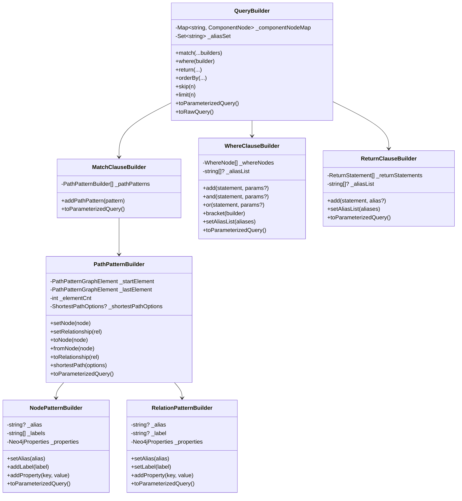
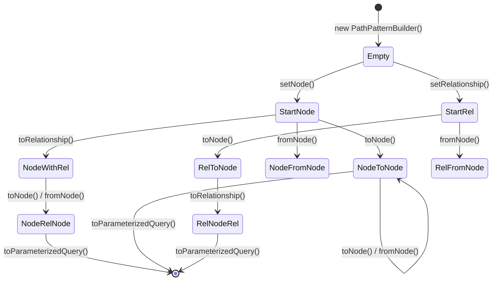
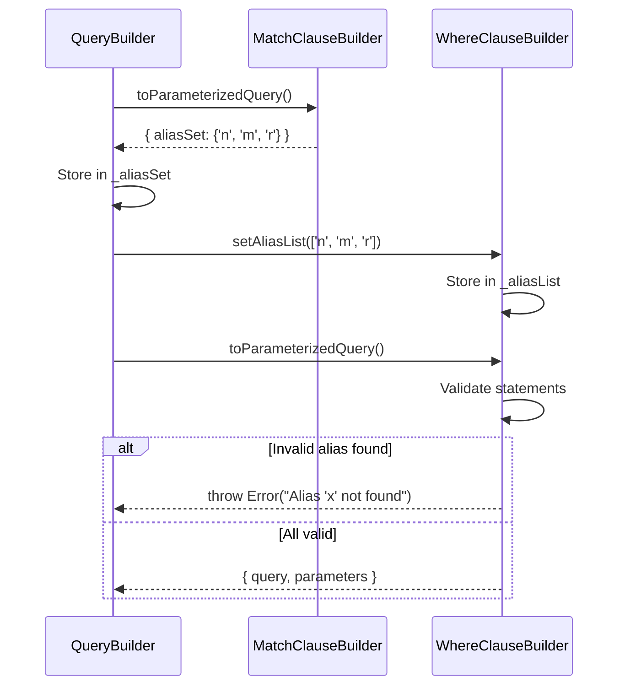
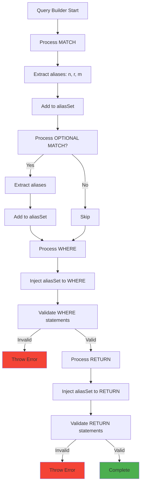

# Query Builder Deep Dive

## Table of Contents

1. [Overview](#overview)
2. [Core Architecture](#core-architecture)
3. [PathPatternBuilder](#pathpatternbuilder)
4. [Clause Builders](#clause-builders)
5. [Component Builders](#component-builders)
6. [Query Assembly](#query-assembly)
7. [Alias Tracking System](#alias-tracking-system)
8. [Advanced Features](#advanced-features)

---

## Overview

The Query Builder module provides a fluent, type-safe API for constructing Cypher queries programmatically. It transforms method chains into parameterized Cypher queries with automatic validation.

### Key Responsibilities

```
┌─────────────────────────────────────────────────────────────┐
│                   QueryBuilder Module                       │
├─────────────────────────────────────────────────────────────┤
│                                                             │
│  ✓ Construct Cypher queries programmatically               │
│  ✓ Manage query component lifecycle                        │
│  ✓ Track and validate aliases                              │
│  ✓ Generate parameterized queries                          │
│  ✓ Enforce query structure rules                           │
│  ✓ Provide fluent, chainable API                           │
│                                                             │
└─────────────────────────────────────────────────────────────┘
```

### Transformation Example

```typescript
// Input: Method chain
QueryBuilder.new()
  .match(p => p
    .setNode({ alias: 'n', labels: ['Person'] })
    .toRelationship({ alias: 'r', label: 'KNOWS' })
    .toNode({ alias: 'm', labels: ['Person'] })
  )
  .where(w => w.add('n.age > 25').and('m.age > 25'))
  .return('n', 'r', 'm')
  .orderBy('n.name', 'ASC')
  .limit(10)

// Output: Parameterized Query
{
  query: `
    MATCH (n:Person)-[r:KNOWS]->(m:Person)
    WHERE n.age > 25 AND m.age > 25
    ORDER BY n.name ASC
    LIMIT 10
    RETURN n, r, m
  `,
  parameters: {},
  aliasSet: Set { 'n', 'r', 'm' }
}
```

---

## Core Architecture

### Component Structure



### Internal State Management

```
QueryBuilder Internal Structure:
════════════════════════════════════════════════════════════════

_componentNodeMap: Map<ComponentType, ComponentNode>
┌────────────────────────────────────────────────────────────┐
│  Key              Value                                    │
├────────────────────────────────────────────────────────────┤
│  "MATCH"       → { type: "MATCH",                          │
│                    builder: MatchClauseBuilder }           │
│                                                            │
│  "WHERE"       → { type: "WHERE",                          │
│                    builder: WhereClauseBuilder }           │
│                                                            │
│  "RETURN"      → { type: "RETURN",                         │
│                    builder: ReturnClauseBuilder }          │
│                                                            │
│  "ORDER BY"    → { type: "ORDER BY",                       │
│                    builder: OrderByClauseBuilder }         │
│                                                            │
│  "LIMIT"       → { type: "LIMIT", limit: number }          │
│                                                            │
│  "SKIP"        → { type: "SKIP", skip: number }            │
└────────────────────────────────────────────────────────────┘

_aliasSet: Set<string>
┌────────────────────────────────────────────────────────────┐
│  { 'n', 'r', 'm', 'p', 'friend', 'knows' }                 │
│                                                            │
│  Populated by selective clauses (MATCH, CREATE, MERGE)    │
│  Used to validate dependent clauses (WHERE, RETURN)        │
└────────────────────────────────────────────────────────────┘
```

### Query Component Types

```typescript
// Discriminated Union for Type Safety
type QueryComponentNode =
  | { type: "MATCH";          builder: MatchClauseBuilder }
  | { type: "OPTIONAL MATCH"; builder: OptionalMatchClauseBuilder }
  | { type: "CREATE";         builder: CreateClauseBuilder }
  | { type: "MERGE";          builder: MergeClauseBuilder }
  | { type: "WHERE";          builder: WhereClauseBuilder }
  | { type: "RETURN";         builder: ReturnClauseBuilder }
  | { type: "ORDER BY";       builder: OrderByClauseBuilder }
  | { type: "SKIP";           skip: number }
  | { type: "LIMIT";          limit: number }
  | { type: "OFFSET";         offset: number }
  | { type: "FINISH" }
```

---

## PathPatternBuilder

The PathPatternBuilder constructs graph path patterns like `(a)-[r]->(b)`.

### Graph Element Linked List

```
Internal Structure:
════════════════════════════════════════════════════════════════

PathPatternBuilder maintains a linked list of graph elements:

_startElement → Element1 → Element2 → Element3 → ... → _lastElement


Example: (n:Person)-[r:KNOWS]->(m:Person)

_startElement
      ↓
┌──────────────┐       ┌──────────────┐       ┌──────────────┐
│ Node         │       │ Relationship │       │ Node         │
│ type: "node" │──────→│ type: "rel"  │──────→│ type: "node" │
│ alias: "n"   │       │ alias: "r"   │       │ alias: "m"   │
│ labels: ["Person"]   │ label: "KNOWS"│       │ labels: ["Person"]
│ nextType:    │       │ nextType:    │       │ nextType:    │
│  "toRelationship"    │  "toNode"    │       │  undefined   │
└──────────────┘       └──────────────┘       └──────────────┘
                                                     ↑
                                              _lastElement


Each element knows:
  • previous: pointer to previous element
  • next: pointer to next element
  • nextType: how to connect to next element
```

### Connection Types

```
Node Connection Types:
════════════════════════════════════════════════════════════════

(n) -- toNode -->       (m)     Directed node-to-node
(n) -- fromNode -->     (m)     Reverse directed node-to-node
(n) -- toRelationship → [r]     Node to outgoing relationship
(n) -- fromRelationship → [r]   Node to incoming relationship
(n) -- unDirectedNode → (m)     Undirected connection


Relationship Connection Types:
════════════════════════════════════════════════════════════════

[r] -- toNode -->       (n)     Relationship to node (outgoing)
[r] -- fromNode -->     (n)     Relationship to node (incoming)


Translation to Cypher:
════════════════════════════════════════════════════════════════

nextType              Connection Symbol
─────────────────────────────────────────────────────────────
toNode                -->
fromNode              <--
toRelationship        -
fromRelationship      <-
unDirectedNode        --

(For relationships)
toNode                ->
fromNode              -
```

### Building Patterns



### Ghost Node Injection

```
Problem: Cypher doesn't allow dangling relationships
════════════════════════════════════════════════════════════════

Invalid:
  -[r:KNOWS]->(n)    ← Starts with relationship
  (n)-[r:KNOWS]->    ← Ends with relationship


Solution: Automatically inject ghost nodes
════════════════════════════════════════════════════════════════

User writes:
  setRelationship({ alias: 'r' }).toNode({ alias: 'n' })

Library generates:
  ()-[r]->(n)
   ↑ Ghost node automatically injected

User is warned:
  console.warn("Adding ghost node to start")


Complete Example:
════════════════════════════════════════════════════════════════

// Single relationship
setRelationship({ alias: 'r' })
  → ()-[r]-()  (ghosts on both ends)

// Relationship with target
setRelationship({ alias: 'r' }).toNode({ alias: 'n' })
  → ()-[r]->(n)  (ghost at start)

// Node with dangling relationship
setNode({ alias: 'n' }).toRelationship({ alias: 'r' })
  → (n)-[r]->()  (ghost at end)
```

### Shortest Path Support

```
Cypher Shortest Path Syntax:
════════════════════════════════════════════════════════════════

p = SHORTEST 1 (a)-[r]->(b)
p = ALL SHORTEST (a)-[r]->(b)
p = SHORTEST 5 GROUPS (a)-[r]->(b)


API Usage:
════════════════════════════════════════════════════════════════

PathPatternBuilder
  .setNode({ alias: 'a' })
  .toRelationship({ alias: 'r' })
  .toNode({ alias: 'b' })
  .shortestPath({
    alias: 'p',
    length: 1,
    isAll: false,
    isGroup: false
  })

Generates:
  p = SHORTEST 1 (a)-[r]->(b)


Options:
┌─────────────────────────────────────────────────────────────┐
│  alias: string     - Path alias (required)                  │
│  length?: number   - Path length (e.g., 1, 5)               │
│  isAll?: boolean   - Use ALL SHORTEST                       │
│  isGroup?: boolean - Add GROUPS                             │
└─────────────────────────────────────────────────────────────┘
```

---

## Clause Builders

### WHERE Clause Builder

The WHERE clause builder creates a tree structure for complex conditional logic.

```
WHERE Tree Structure:
════════════════════════════════════════════════════════════════

type WhereNode =
  | { type: "statement"; statement: string; parameters?: {...} }
  | { type: "and" }
  | { type: "or" }
  | { type: "bracket"; subNodes: WhereNode[] }


Example: n.age > 25 AND (m.city = "NYC" OR m.city = "LA")

Root: [ Node1, AND, Node2 ]
        ↓            ↓
    Statement    Bracket
    "n.age>25"      ↓
                SubNodes: [ Node3, OR, Node4 ]
                            ↓            ↓
                        Statement    Statement
                        "m.city=NYC" "m.city=LA"


Tree Structure:
════════════════════════════════════════════════════════════════

                    _whereNodes[]
                         │
          ┌──────────────┼──────────────┐
          │              │              │
     statement("n.age>25") AND    bracket
                                      │
                               ┌──────┼──────┐
                               │      │      │
                         statement  OR  statement
                         ("m.city=   ("m.city=
                          'NYC'")     'LA'")
```

### Building Complex Conditions

```typescript
// Simple condition
where(w => w.add('n.age > 25'))
// → WHERE n.age > 25

// AND condition
where(w => w
  .add('n.age > 25')
  .and('n.city = "NYC"')
)
// → WHERE n.age > 25 AND n.city = "NYC"

// OR condition
where(w => w
  .add('n.age > 25')
  .or('n.age < 18')
)
// → WHERE n.age > 25 OR n.age < 18

// Nested brackets
where(w => w
  .add('n.age > 25')
  .and(w => w.bracket(b => b
    .add('m.city = "NYC"')
    .or('m.city = "LA"')
  ))
)
// → WHERE n.age > 25 AND (m.city = "NYC" OR m.city = "LA")
```

### Alias Validation Flow



### Parameter Randomization

```
Problem: Parameter key collisions in complex queries
════════════════════════════════════════════════════════════════

where(w => w
  .add('n.age > $age', { age: 25 })
  .and('m.age > $age', { age: 30 })  ← Collision!
)


Solution: Randomize parameter keys
════════════════════════════════════════════════════════════════

Internal transformation:
  $age → $age_a7f3d9c2
  $age → $age_8e4b1f5a

Generated:
  WHERE n.age > $age_a7f3d9c2 AND m.age > $age_8e4b1f5a

Parameters:
  { age_a7f3d9c2: 25, age_8e4b1f5a: 30 }


Implementation:
════════════════════════════════════════════════════════════════

function randomizeParameterKeys(
  statement: string,
  parameters: Neo4jProperties
): { statement: string; parameters: Neo4jProperties } {
  const randomSuffix = uuid().substring(0, 8);

  const newStatement = statement.replace(
    /\$(\w+)/g,
    (match, key) => `$${key}_${randomSuffix}`
  );

  const newParameters = {};
  for (const [key, value] of Object.entries(parameters)) {
    newParameters[`${key}_${randomSuffix}`] = value;
  }

  return { statement: newStatement, parameters: newParameters };
}
```

---

## Component Builders

### NodePatternBuilder

```
Node Pattern Structure:
════════════════════════════════════════════════════════════════

(alias:Label1:Label2 {property1: value1, property2: value2})
  │     │      │       │
  │     │      │       └─ Properties (object)
  │     │      └─ Additional labels
  │     └─ Primary label
  └─ Alias (variable name)


All parts are optional:
  ()                                    ✓ Valid (anonymous node)
  (n)                                   ✓ Valid (alias only)
  (:Person)                             ✓ Valid (label only)
  (n:Person)                            ✓ Valid (alias + label)
  (n:Person {name: "John"})             ✓ Valid (full)
  (n:Person:Employee)                   ✓ Valid (multiple labels)
```

### Building Node Patterns

```typescript
// Method 1: Constructor
new NodePatternBuilder({
  alias: 'n',
  labels: ['Person', 'Employee'],
  properties: { name: 'John', age: 30 }
})

// Method 2: Fluent API
new NodePatternBuilder()
  .setAlias('n')
  .addLabel('Person')
  .addLabel('Employee')
  .addProperty('name', 'John')
  .addProperty('age', 30)

// Method 3: Inline in PathPatternBuilder
PathPatternBuilder.new()
  .setNode({
    alias: 'n',
    labels: ['Person'],
    properties: { name: 'John' }
  })
```

### Property Handling

```
Property Types:
════════════════════════════════════════════════════════════════

type Neo4jPrimitive =
  | string                    → "value"
  | number                    → 42
  | boolean                   → true
  | (string|number|boolean)[] → [1, 2, 3]
  | null                      → null
  | undefined                 → (omitted from query)
  | (() => string)            → function expression


Examples:
════════════════════════════════════════════════════════════════

{
  name: "John",              → name: $name_xyz
  age: 30,                   → age: $age_xyz
  active: true,              → active: $active_xyz
  tags: ["dev", "senior"],   → tags: $tags_xyz
  score: null,               → score: $score_xyz
  metadata: undefined,       → (omitted)
  timestamp: () => "timestamp()"  → timestamp: timestamp()
}

Parameters:
{
  name_xyz: "John",
  age_xyz: 30,
  active_xyz: true,
  tags_xyz: ["dev", "senior"],
  score_xyz: null
}
```

### RelationPatternBuilder

```
Relationship Pattern Structure:
════════════════════════════════════════════════════════════════

[alias:TYPE {property1: value1, property2: value2}]
  │     │    │
  │     │    └─ Properties (object)
  │     └─ Relationship type (SINGLE, not multiple)
  └─ Alias (variable name)


Key Difference from Nodes:
  Relationships have ONE type, nodes can have MANY labels!

Valid:
  [r:KNOWS]                             ✓
  [r:KNOWS {since: 2020}]               ✓
  [:KNOWS]                              ✓ (anonymous)

Invalid:
  [r:KNOWS:FRIEND]                      ✗ (multiple types not allowed)


API Usage:
════════════════════════════════════════════════════════════════

new RelationPatternBuilder({
  alias: 'r',
  label: 'KNOWS',  // Single label!
  properties: { since: 2020 }
})
```

---

## Query Assembly

### Assembly Order

```
Query Component Assembly Order:
════════════════════════════════════════════════════════════════

The QueryBuilder assembles components in a specific order:

┌─────────────────────────────────────────────────────────────┐
│  1. MATCH                                                   │
│     └─ Selective clause (populates aliasSet)               │
├─────────────────────────────────────────────────────────────┤
│  2. OPTIONAL MATCH                                          │
│     └─ Selective clause (populates aliasSet)               │
├─────────────────────────────────────────────────────────────┤
│  3. MERGE                                                   │
│     └─ Selective clause (populates aliasSet)               │
├─────────────────────────────────────────────────────────────┤
│  4. CREATE                                                  │
│     └─ Selective clause (populates aliasSet)               │
├─────────────────────────────────────────────────────────────┤
│  5. WHERE                                                   │
│     └─ Dependent clause (validates against aliasSet)       │
├─────────────────────────────────────────────────────────────┤
│  6. ORDER BY                                                │
│     └─ Dependent clause (validates against aliasSet)       │
├─────────────────────────────────────────────────────────────┤
│  7. SKIP                                                    │
├─────────────────────────────────────────────────────────────┤
│  8. LIMIT                                                   │
├─────────────────────────────────────────────────────────────┤
│  9. OFFSET                                                  │
├─────────────────────────────────────────────────────────────┤
│  10. RETURN or FINISH                                       │
│      └─ Dependent clause (validates against aliasSet)      │
│      └─ Mutually exclusive                                 │
└─────────────────────────────────────────────────────────────┘
```

### Assembly Algorithm

```typescript
toParameterizedQuery(): ParameterizedQuery {
  const queryContext: ParameterizedQuery = {
    aliasSet: new Set(),
    query: "",
    parameters: {}
  };

  // 1. Process selective clauses (MATCH, OPTIONAL MATCH, MERGE, CREATE)
  //    These populate the alias set
  for (const componentType of ["MATCH", "OPTIONAL MATCH", "MERGE", "CREATE"]) {
    const component = this._componentNodeMap.get(componentType);
    if (component) {
      const result = component.builder.toParameterizedQuery();

      // Append query
      queryContext.query += result.query + "\n";

      // Merge parameters
      Object.assign(queryContext.parameters, result.parameters);

      // Merge aliases
      for (const alias of result.aliasSet) {
        queryContext.aliasSet.add(alias);
      }
    }
  }

  // 2. Process dependent clauses (WHERE, ORDER BY, RETURN)
  //    These validate against the alias set
  for (const componentType of ["WHERE", "ORDER BY"]) {
    const component = this._componentNodeMap.get(componentType);
    if (component) {
      // Inject alias list for validation
      component.builder.setAliasList(Array.from(queryContext.aliasSet));

      const result = component.builder.toParameterizedQuery();
      queryContext.query += result.query + "\n";
      Object.assign(queryContext.parameters, result.parameters);
    }
  }

  // 3. Process pagination (SKIP, LIMIT, OFFSET)
  // ... (simple numeric values)

  // 4. Process RETURN or FINISH
  const returnComponent = this._componentNodeMap.get("RETURN");
  const finishComponent = this._componentNodeMap.get("FINISH");

  if (returnComponent && finishComponent) {
    throw new Error("Cannot have both RETURN and FINISH");
  }

  // ... process return/finish

  return queryContext;
}
```

### Parameter Merging

```
Parameter Merging Strategy:
════════════════════════════════════════════════════════════════

Each clause builder generates its own parameters:

Match:   { name_a1b2: "John" }
Where:   { age_c3d4: 25, city_e5f6: "NYC" }
Return:  (no parameters)

Final merge:
{
  name_a1b2: "John",
  age_c3d4: 25,
  city_e5f6: "NYC"
}


Collision Prevention:
════════════════════════════════════════════════════════════════

UUID suffixes ensure no collisions:
  $name → $name_a1b2c3
  $name → $name_d4e5f6  (different UUID)

Even if the same property name is used multiple times,
each gets a unique parameter key.
```

---

## Alias Tracking System

### How It Works



### Example Flow

```
Step 1: Process MATCH
════════════════════════════════════════════════════════════════
.match(p => p
  .setNode({ alias: 'person' })
  .toRelationship({ alias: 'knows' })
  .toNode({ alias: 'friend' })
)

Extracted aliases: { 'person', 'knows', 'friend' }
aliasSet = { 'person', 'knows', 'friend' }


Step 2: Process WHERE
════════════════════════════════════════════════════════════════
.where(w => w.add('person.age > 25'))

1. Inject aliasSet: ['person', 'knows', 'friend']
2. Parse statement: 'person.age > 25'
3. Extract referenced alias: 'person'
4. Validate: 'person' ∈ aliasSet? ✓ YES
5. Continue


Step 3: Process RETURN
════════════════════════════════════════════════════════════════
.return('person', 'friend')

1. Inject aliasSet: ['person', 'knows', 'friend']
2. Validate: 'person' ∈ aliasSet? ✓ YES
3. Validate: 'friend' ∈ aliasSet? ✓ YES
4. Continue


Error Example:
════════════════════════════════════════════════════════════════
.where(w => w.add('stranger.age > 25'))
                     ↑
                     'stranger' not in aliasSet

Error: Alias 'stranger' not found in selected components.
       Available aliases: person, knows, friend
```

---

## Advanced Features

### Multiple Path Patterns

```typescript
// Multiple path patterns in one MATCH
.match(
  p => p.setNode({ alias: 'a' }).toNode({ alias: 'b' }),
  p => p.setNode({ alias: 'c' }).toNode({ alias: 'd' })
)

// Generates:
// MATCH (a)-->(b), (c)-->(d)
```

### Additive Methods

```typescript
// Start with one pattern
.match(p => p.setNode({ alias: 'a' }))

// Add more patterns
.addMatch(p => p.setNode({ alias: 'b' }))
.addMatch(p => p.setNode({ alias: 'c' }))

// Generates:
// MATCH (a), (b), (c)
```

### Complex WHERE Conditions

```typescript
.where(w => w
  .add('n.age > 25')
  .and(w => w.bracket(b => b
    .add('n.city = "NYC"')
    .or('n.city = "LA"')
    .or('n.city = "SF"')
  ))
  .and('n.active = true')
)

// Generates:
// WHERE n.age > 25 AND (n.city = "NYC" OR n.city = "LA" OR n.city = "SF") AND n.active = true
```

### Method Overloading

```typescript
// Different ways to add RETURN
.return('n')
.return(['n', 'm'])
.return('n', 'person')  // with alias
.return(r => r.add('n').add('m'))
.return(returnBuilderInstance)
```

---

## Performance Considerations

### String Building

```
Efficient String Concatenation:
════════════════════════════════════════════════════════════════

✓ Used:
  query += "MATCH (n)\n"
  query += "WHERE n.age > 25\n"

✗ Avoided:
  query = `${query}MATCH (n)\n`
  (Template literals create new strings each time)
```

### Map vs Array for Components

```
Why Map instead of Array:
════════════════════════════════════════════════════════════════

Map Lookup:  O(1)
Array Search: O(n)

Since we only have one of each component type,
Map provides instant lookup by component type.

this._componentNodeMap.get("WHERE")  // O(1)

vs.

this._componentList.find(c => c.type === "WHERE")  // O(n)
```

### Builder Reuse

```
Anti-Pattern (Don't do this):
════════════════════════════════════════════════════════════════

const builder = QueryBuilder.new();
builder.match(...);
builder.toParameterizedQuery();

// Reuse builder
builder.where(...);  // Modifies previous query!


Correct Pattern:
════════════════════════════════════════════════════════════════

// Create new builder each time
const query1 = QueryBuilder.new()
  .match(...)
  .return(...)
  .toParameterizedQuery();

const query2 = QueryBuilder.new()
  .match(...)
  .where(...)
  .return(...)
  .toParameterizedQuery();
```

---

## Summary

The Query Builder module provides:

```
✓ Type-safe query construction
✓ Fluent, chainable API
✓ Automatic parameterization
✓ Alias tracking and validation
✓ Complex condition support
✓ Shortest path queries
✓ Multiple pattern matching
✓ Build-time error detection
```

**Key Takeaways:**

1. **Builder pattern** enables progressive construction
2. **Linked lists** represent graph patterns naturally
3. **Tree structures** handle complex WHERE conditions
4. **Alias tracking** prevents runtime errors
5. **Component map** ensures single instances and fast lookup
6. **Parameterization** prevents injection attacks

---

**Next:** [Session Pool Deep Dive →](./04-session-pool.md)
