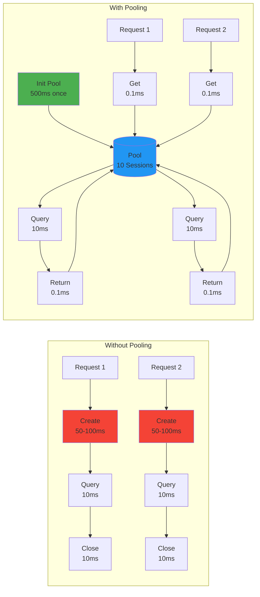
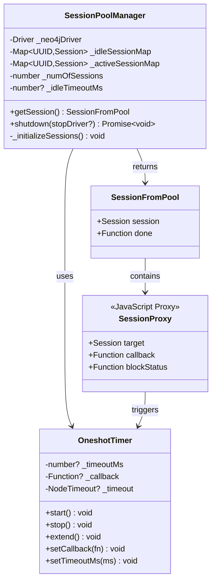
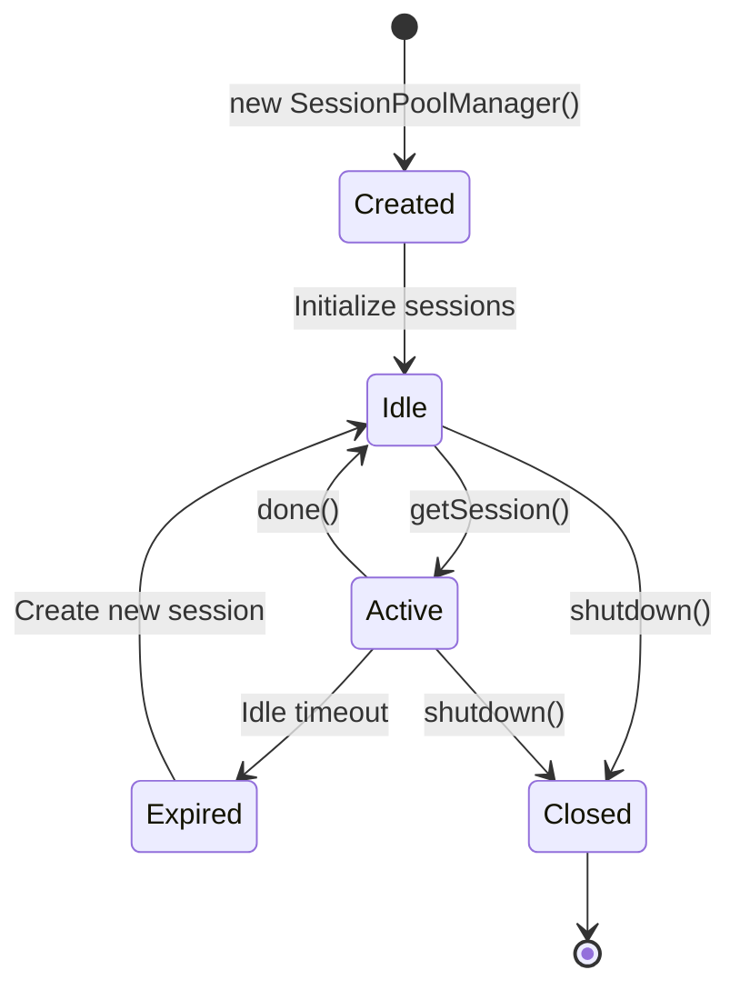
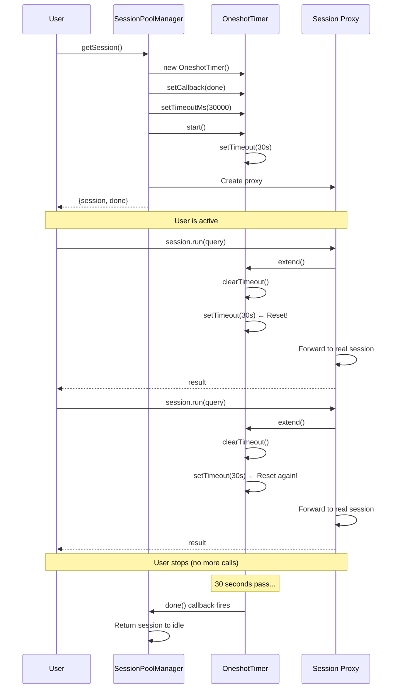

# Session Pool Deep Dive

## Table of Contents

1. [Overview](#overview)
2. [Why Session Pooling?](#why-session-pooling)
3. [Architecture](#architecture)
4. [Session Lifecycle](#session-lifecycle)
5. [Proxy Pattern Implementation](#proxy-pattern-implementation)
6. [Idle Timeout Management](#idle-timeout-management)
7. [Error Handling](#error-handling)
8. [Performance Characteristics](#performance-characteristics)

---

## Overview

The Session Pool module manages a pool of Neo4j sessions, providing efficient connection reuse and automatic lifecycle management.

### Key Responsibilities

```
┌─────────────────────────────────────────────────────────────┐
│               SessionPoolManager Module                     │
├─────────────────────────────────────────────────────────────┤
│                                                             │
│  ✓ Maintain pool of Neo4j sessions                         │
│  ✓ Track session state (idle vs active)                    │
│  ✓ Provide session checkout/checkin                        │
│  ✓ Manage idle timeouts                                    │
│  ✓ Block usage of returned sessions                        │
│  ✓ Graceful shutdown                                       │
│                                                             │
└─────────────────────────────────────────────────────────────┘
```

### Configuration

```typescript
new SessionPoolManager({
  neo4jDriver: driver,           // Required: Neo4j driver instance
  numberOfSessions?: number,     // Optional: Pool size (default: 10)
  idleTimeoutMs?: number,       // Optional: Auto-return timeout
})
```

---

## Why Session Pooling?

### The Problem

```
Without Pooling:
════════════════════════════════════════════════════════════════

Request 1:
  ├─ Create Session      (~50-100ms)
  │   ├─ Network handshake
  │   ├─ Authentication
  │   └─ Resource allocation
  ├─ Execute Query       (~10ms)
  └─ Close Session       (~10ms)

Request 2:
  ├─ Create Session      (~50-100ms)  ← Expensive again!
  ├─ Execute Query       (~10ms)
  └─ Close Session       (~10ms)

Total time per request: ~70-120ms
Connection overhead: ~85% of total time!
```

### The Solution

```
With Pooling:
════════════════════════════════════════════════════════════════

Initialization (once):
  └─ Create 10 Sessions  (~500-1000ms total)

Request 1:
  ├─ Get Session from Pool  (~0.1ms)  ← Instant!
  ├─ Execute Query          (~10ms)
  └─ Return to Pool         (~0.1ms)

Request 2:
  ├─ Get Session from Pool  (~0.1ms)  ← Reuse!
  ├─ Execute Query          (~10ms)
  └─ Return to Pool         (~0.1ms)

Total time per request: ~10ms
Connection overhead: ~2% of total time!

Speedup: 7-12x faster! 🚀
```

### Efficiency Comparison



---

## Architecture

### Internal State

```
SessionPoolManager Internal Structure:
════════════════════════════════════════════════════════════════

┌────────────────────────────────────────────────────────────┐
│  SessionPoolManager                                        │
│                                                            │
│  ┌──────────────────────────────────────────────────────┐ │
│  │ _neo4jDriver: Driver                                 │ │
│  │   └─ Neo4j driver instance                           │ │
│  └──────────────────────────────────────────────────────┘ │
│                                                            │
│  ┌──────────────────────────────────────────────────────┐ │
│  │ _idleSessionMap: Map<UUID, Session>                  │ │
│  │   ├─ "a1b2c3d4" → Session #1                         │ │
│  │   ├─ "e5f6g7h8" → Session #2                         │ │
│  │   ├─ "i9j0k1l2" → Session #3                         │ │
│  │   └─ ...                                             │ │
│  │                                                       │ │
│  │   Sessions waiting to be used                        │ │
│  └──────────────────────────────────────────────────────┘ │
│                                                            │
│  ┌──────────────────────────────────────────────────────┐ │
│  │ _activeSessionMap: Map<UUID, Session>                │ │
│  │   ├─ "m3n4o5p6" → Session #4                         │ │
│  │   ├─ "q7r8s9t0" → Session #5                         │ │
│  │   └─ ...                                             │ │
│  │                                                       │ │
│  │   Sessions currently in use                          │ │
│  └──────────────────────────────────────────────────────┘ │
│                                                            │
│  ┌──────────────────────────────────────────────────────┐ │
│  │ Configuration                                         │ │
│  │   ├─ _numOfSessions: 10                              │ │
│  │   └─ _idleTimeoutMs?: 30000                          │ │
│  └──────────────────────────────────────────────────────┘ │
└────────────────────────────────────────────────────────────┘
```

### Class Diagram



---

## Session Lifecycle

### State Transitions



### Detailed Flow

```
1. Initialization
════════════════════════════════════════════════════════════════

new SessionPoolManager({ neo4jDriver, numberOfSessions: 10 })
    ↓
for i = 0 to 9:
    session = driver.session()
    uuid = generateUUID()
    _idleSessionMap.set(uuid, session)
    ↓
Pool ready with 10 idle sessions


2. Session Checkout (getSession)
════════════════════════════════════════════════════════════════

User calls: getSession()
    ↓
Check: _idleSessionMap.size > 0?
    ├─ No  → throw NoSessionException
    └─ Yes → Continue
    ↓
Select random session from _idleSessionMap
    ├─ Get random entry: [uuid, session]
    ├─ Remove from _idleSessionMap
    └─ Add to _activeSessionMap
    ↓
Create done() callback
    ↓
Create OneshotTimer (if idleTimeoutMs configured)
    ├─ Set callback: done()
    ├─ Set timeout: idleTimeoutMs
    └─ Start timer
    ↓
Wrap session in Proxy
    ├─ Intercept all method calls
    ├─ On each call: extend timer
    └─ Block calls if session returned
    ↓
Return { session: ProxiedSession, done: Function }


3. Session Usage
════════════════════════════════════════════════════════════════

const { session, done } = pool.getSession();
    ↓
session.run(query, params)
    ├─ Proxy intercepts call
    ├─ Extends idle timeout ← Activity detected!
    ├─ Forwards to real session
    └─ Returns result
    ↓
session.run(anotherQuery, params)
    ├─ Proxy intercepts call
    ├─ Extends idle timeout ← More activity!
    └─ Forwards to real session


4. Session Checkin (done)
════════════════════════════════════════════════════════════════

done()
    ↓
Check: session already returned?
    ├─ Yes → return false (no-op)
    └─ No  → Continue
    ↓
Stop idle timeout timer
    ↓
Remove from _activeSessionMap
    ↓
Add back to _idleSessionMap
    ↓
Proxy blocks further calls
    └─ Any method call → throw Error


5. Idle Timeout (Automatic)
════════════════════════════════════════════════════════════════

Session inactive for idleTimeoutMs
    ↓
OneshotTimer fires
    ↓
Calls done() callback automatically
    ↓
Session returned to pool
```

### Visual Flow

```
Time →
════════════════════════════════════════════════════════════════

t0:  Pool Initialization
     ┌─────────────────────────────────────────────────────┐
     │ Idle: [S1, S2, S3, S4, S5, S6, S7, S8, S9, S10]     │
     │ Active: []                                          │
     └─────────────────────────────────────────────────────┘

t1:  User 1 gets session
     ┌─────────────────────────────────────────────────────┐
     │ Idle: [S2, S3, S4, S5, S6, S7, S8, S9, S10]         │
     │ Active: [S1]  ← Timer started                       │
     └─────────────────────────────────────────────────────┘

t2:  User 2 gets session
     ┌─────────────────────────────────────────────────────┐
     │ Idle: [S3, S4, S5, S6, S7, S8, S9, S10]             │
     │ Active: [S1, S2]  ← Two timers running              │
     └─────────────────────────────────────────────────────┘

t3:  User 1 calls done()
     ┌─────────────────────────────────────────────────────┐
     │ Idle: [S1, S3, S4, S5, S6, S7, S8, S9, S10]         │
     │ Active: [S2]  ← S1 returned                         │
     └─────────────────────────────────────────────────────┘

t4:  User 2's session times out (auto-return)
     ┌─────────────────────────────────────────────────────┐
     │ Idle: [S1, S2, S3, S4, S5, S6, S7, S8, S9, S10]     │
     │ Active: []  ← S2 auto-returned                      │
     └─────────────────────────────────────────────────────┘
```

---

## Proxy Pattern Implementation

### Why Proxy?

```
Problem: How to ensure safety and track activity?
════════════════════════════════════════════════════════════════

1. Block method calls on returned sessions
   (Prevent use-after-return bugs)

2. Extend idle timeout on activity
   (Don't timeout active sessions)

3. Transparent to user
   (Looks like a normal Session)


Solution: JavaScript Proxy
════════════════════════════════════════════════════════════════

Wrap the real session in a Proxy that intercepts
all method calls and applies our logic.
```

### Implementation

```typescript
function proxyWithException<T extends object>(params: {
  target: T;                      // Real session
  callback?: () => void;          // Called before each method
  blockStatus: () => boolean;     // Check if should block
  exceptionMessage?: string;      // Error message
}): T {
  const { target, callback, blockStatus, exceptionMessage } = params;

  return new Proxy(target, {
    get(target: any, prop: string | symbol) {
      const originalMethod = target[prop];

      // Only intercept function calls
      if (typeof originalMethod === "function") {
        return function (...args: any[]) {
          // 1. Execute callback (extend timeout)
          callback?.();

          // 2. Check if blocked (session returned?)
          if (blockStatus()) {
            throw new Error(
              exceptionMessage || "Method call blocked"
            );
          }

          // 3. Forward to real method
          return originalMethod.apply(target, args);
        };
      }

      // Non-function properties pass through
      return originalMethod;
    },
  });
}
```

### Proxy in Action

```
Example: Session with Proxy
════════════════════════════════════════════════════════════════

const { session, done } = pool.getSession();

// Behind the scenes:
realSession = driver.session();
isReturned = false;

proxiedSession = new Proxy(realSession, {
  get(target, prop) {
    if (typeof target[prop] === "function") {
      return function(...args) {
        // Step 1: Extend timeout
        timer.extend();

        // Step 2: Check if returned
        if (isReturned) {
          throw new Error("Session has been returned to pool");
        }

        // Step 3: Call real method
        return target[prop].apply(target, args);
      };
    }
    return target[prop];
  }
});


Usage:
════════════════════════════════════════════════════════════════

// ✓ Works: session active
session.run("MATCH (n) RETURN n")
    ↓
  1. timer.extend()  ← Timeout extended!
  2. isReturned? No
  3. realSession.run(...) ← Forwarded

// Return session
done()
    ↓
  isReturned = true


// ✗ Blocked: session returned
session.run("MATCH (n) RETURN n")
    ↓
  1. timer.extend()  ← Still called
  2. isReturned? YES ← Blocked here!
  3. throw Error("Session has been returned to pool")
```

### Proxy Benefits

```
┌─────────────────────────────────────────────────────────────┐
│  Proxy Benefits                                             │
├─────────────────────────────────────────────────────────────┤
│                                                             │
│  ✓ Transparent                                              │
│    User doesn't know they're using a proxy                 │
│                                                             │
│  ✓ Safety                                                   │
│    Prevents use-after-return bugs                          │
│                                                             │
│  ✓ Activity Tracking                                        │
│    Automatically extends timeout on any method call        │
│                                                             │
│  ✓ No Modification                                          │
│    Doesn't modify the original Session class               │
│                                                             │
│  ✓ Flexible                                                 │
│    Easy to add more interceptors in the future             │
│                                                             │
└─────────────────────────────────────────────────────────────┘
```

---

## Idle Timeout Management

### OneshotTimer Implementation

```typescript
class OneshotTimer {
  private _timeoutMs?: number;
  private _callback?: () => void;
  private _timeout?: NodeJS.Timeout;

  start() {
    if (!this._timeoutMs || !this._callback) return;

    this._timeout = setTimeout(() => {
      this._callback?.();
    }, this._timeoutMs);
  }

  stop() {
    if (this._timeout) {
      clearTimeout(this._timeout);
      this._timeout = undefined;
    }
  }

  extend() {
    this.stop();
    this.start();
  }

  setCallback(callback: () => void) {
    this._callback = callback;
  }

  setTimeoutMs(ms: number) {
    this._timeoutMs = ms;
  }
}
```

### Timeout Flow



### Timeline Example

```
Timeline: 30-second idle timeout
════════════════════════════════════════════════════════════════

t=0s:    getSession()
         └─ Timer starts (30s)

t=5s:    session.run(query1)
         └─ Timer extends (reset to 30s from now)

t=15s:   session.run(query2)
         └─ Timer extends (reset to 30s from now)

t=25s:   session.run(query3)
         └─ Timer extends (reset to 30s from now)

t=40s:   (No activity for 15 seconds)

t=50s:   (No activity for 25 seconds)

t=55s:   (30 seconds since last activity)
         └─ Timer fires!
         └─ done() called automatically
         └─ Session returned to pool


Without extending:
════════════════════════════════════════════════════════════════

t=0s:    getSession()
         └─ Timer starts (30s)

t=5s:    session.run(query1)
         └─ (No extend)

t=30s:   Timer fires! ← Session returned mid-use!
         └─ Session returned to pool
         └─ Next query would fail!


With extending (actual behavior):
════════════════════════════════════════════════════════════════

t=0s:    getSession()
         └─ Timer starts (30s)

t=5s:    session.run(query1)
         └─ Timer extends → new timeout at t=35s

t=15s:   session.run(query2)
         └─ Timer extends → new timeout at t=45s

t=45s:   (30s since last activity at t=15s)
         └─ Timer fires
         └─ Session safely returned
```

---

## Error Handling

### Exception Types

```typescript
class NoSessionException extends Error {
  constructor() {
    super("No idle sessions available in the pool");
  }
}
```

### Error Scenarios

```
Scenario 1: Pool Exhausted
════════════════════════════════════════════════════════════════

Pool size: 3
Active: [S1, S2, S3]
Idle: []

User requests: getSession()
    ↓
throw NoSessionException


How to handle:
──────────────────────────────────────────────────────────────
try {
  const { session, done } = pool.getSession();
  // ... use session ...
  done();
} catch (error) {
  if (error instanceof NoSessionException) {
    // Wait and retry, or queue request
    await wait(100);
    retry();
  }
}


Scenario 2: Using Returned Session
════════════════════════════════════════════════════════════════

const { session, done } = pool.getSession();
done();  ← Session returned

session.run(query);  ← Try to use
    ↓
Proxy blocks:
throw Error("Session has been returned to the pool")


How to prevent:
──────────────────────────────────────────────────────────────
const { session, done } = pool.getSession();
try {
  const result = await session.run(query);
  return result;
} finally {
  done();  ← Always return in finally
}


Scenario 3: Shutdown Failure
════════════════════════════════════════════════════════════════

await pool.shutdown()
    ↓
Some sessions fail to close
    ↓
throw Error("Failed to close all sessions. 2 sessions failed...")


How to handle:
──────────────────────────────────────────────────────────────
try {
  await pool.shutdown();
} catch (error) {
  console.error("Shutdown failed:", error);
  // Log for investigation
}
```

---

## Performance Characteristics

### Benchmark Comparison

```
Operation Costs:
════════════════════════════════════════════════════════════════

Session Creation (No Pool):
  Network handshake:     20-30ms
  Authentication:        20-30ms
  Resource allocation:   10-40ms
  ─────────────────────────────
  Total:                 50-100ms


Session Checkout (With Pool):
  Random selection:      <0.01ms
  Map operations:        0.05ms
  Proxy creation:        0.05ms
  ─────────────────────────────
  Total:                 ~0.1ms

  Speedup: 500-1000x faster! 🚀


Session Return (With Pool):
  Map operations:        0.05ms
  Timer cleanup:         0.05ms
  ─────────────────────────────
  Total:                 ~0.1ms
```

### Memory Usage

```
Memory Footprint:
════════════════════════════════════════════════════════════════

Per Session (approximate):
  Neo4j Session object:  ~10KB
  UUID string:           ~36 bytes
  Timer object:          ~1KB
  Proxy wrapper:         ~1KB
  ─────────────────────────────
  Total per session:     ~12KB

For 10-session pool:     ~120KB
For 100-session pool:    ~1.2MB

Conclusion: Very lightweight! 💡
```

### Scalability

```
Pool Size Trade-offs:
════════════════════════════════════════════════════════════════

Small Pool (5-10 sessions):
  ✓ Low memory usage
  ✓ Fewer idle connections
  ✗ May exhaust under high load
  ✗ More frequent NoSessionException

Large Pool (50-100 sessions):
  ✓ Can handle high concurrency
  ✓ Rare NoSessionException
  ✗ Higher memory usage
  ✗ More idle connections

Recommended:
  - Start with 10 (default)
  - Monitor NoSessionException frequency
  - Increase if needed
  - Typical: 1-2 sessions per CPU core
```

---

## Best Practices

### 1. Always Use try-finally

```typescript
// ✓ GOOD
const { session, done } = pool.getSession();
try {
  const result = await session.run(query);
  return result;
} finally {
  done();  // Always returns, even on error
}

// ✗ BAD
const { session, done } = pool.getSession();
const result = await session.run(query);  // May throw
done();  // Never called if error occurs!
```

### 2. Handle NoSessionException

```typescript
// ✓ GOOD
async function executeQuery(query, params) {
  const maxRetries = 3;
  let retries = 0;

  while (retries < maxRetries) {
    try {
      const { session, done } = pool.getSession();
      try {
        return await session.run(query, params);
      } finally {
        done();
      }
    } catch (error) {
      if (error instanceof NoSessionException && retries < maxRetries - 1) {
        retries++;
        await wait(100 * retries);  // Exponential backoff
        continue;
      }
      throw error;
    }
  }
}
```

### 3. Configure Idle Timeout Appropriately

```typescript
// For short-lived operations
new SessionPoolManager({
  neo4jDriver: driver,
  numberOfSessions: 10,
  idleTimeoutMs: 10000  // 10 seconds
});

// For long-running operations
new SessionPoolManager({
  neo4jDriver: driver,
  numberOfSessions: 10,
  idleTimeoutMs: 300000  // 5 minutes
});

// No timeout (manual management only)
new SessionPoolManager({
  neo4jDriver: driver,
  numberOfSessions: 10
  // idleTimeoutMs omitted
});
```

### 4. Shutdown Gracefully

```typescript
// Application shutdown
process.on('SIGTERM', async () => {
  console.log('Shutting down...');
  await pool.shutdown();  // Close all sessions
  process.exit(0);
});
```

---

## Summary

The Session Pool module provides:

```
✓ Efficient session reuse (500-1000x faster than creation)
✓ Automatic lifecycle management
✓ Idle timeout support
✓ Safe proxy-wrapped sessions
✓ Graceful shutdown
✓ Low memory footprint
✓ Simple API (get/done pattern)
```

**Key Takeaways:**

1. **Pooling dramatically improves performance** - Reuse is much faster than creation
2. **Proxy pattern ensures safety** - Prevents use-after-return bugs
3. **Idle timeout prevents leaks** - Automatic return for abandoned sessions
4. **Always use try-finally** - Ensure sessions are returned
5. **Handle exhaustion** - Retry on NoSessionException
6. **Configure appropriately** - Match pool size and timeout to workload

---

**Next:** [Manager Integration →](./05-manager.md)
