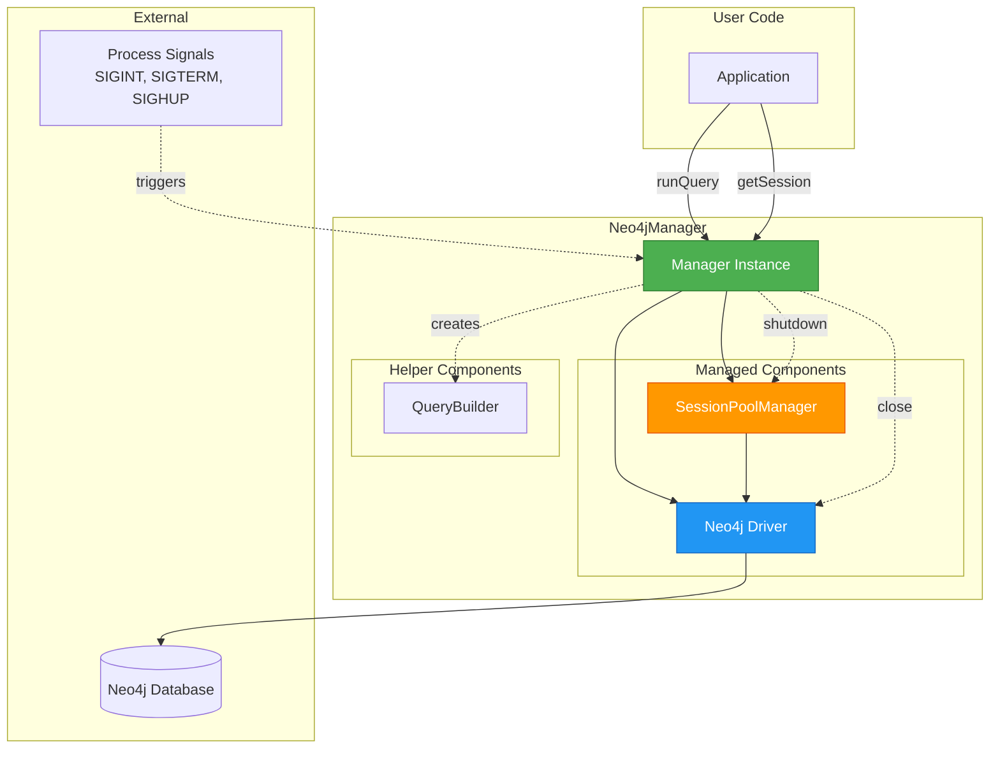
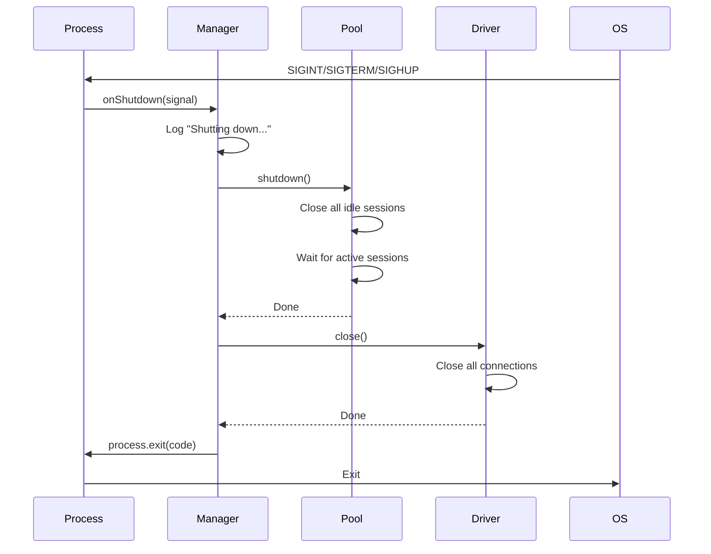

# Manager Integration

## Table of Contents

1. [Overview](#overview)
2. [Architecture](#architecture)
3. [Configuration](#configuration)
4. [API Methods](#api-methods)
5. [Process Lifecycle Management](#process-lifecycle-management)
6. [Usage Examples](#usage-examples)
7. [Best Practices](#best-practices)

---

## Overview

The `Neo4jManager` class is a high-level facade that combines the Neo4j driver, session pool, and query builder into a unified interface for convenient Neo4j interaction.

### Purpose

```
┌─────────────────────────────────────────────────────────────┐
│                    Neo4jManager Role                        │
├─────────────────────────────────────────────────────────────┤
│                                                             │
│  Integration Layer                                          │
│  ├─ Combines driver + pool + query builder                 │
│  ├─ Provides unified API                                    │
│  └─ Manages component lifecycle                             │
│                                                             │
│  Convenience                                                │
│  ├─ Simplifies common operations                           │
│  ├─ Reduces boilerplate                                    │
│  └─ Handles resource management                            │
│                                                             │
│  Process Management                                         │
│  ├─ Graceful shutdown on signals                           │
│  ├─ Cleanup on process exit                                │
│  └─ Resource leak prevention                               │
│                                                             │
└─────────────────────────────────────────────────────────────┘
```

---

## Architecture

### Component Integration



### Internal Structure

```
Neo4jManager Composition:
════════════════════════════════════════════════════════════════

┌────────────────────────────────────────────────────────────┐
│  Neo4jManager                                              │
│                                                            │
│  ┌──────────────────────────────────────────────────────┐ │
│  │  _sessionPool: SessionPoolManager                    │ │
│  │      │                                               │ │
│  │      ├─ Manages session pool                        │ │
│  │      ├─ Provides getSession()                       │ │
│  │      └─ Handles shutdown()                          │ │
│  └──────────────────────────────────────────────────────┘ │
│                                                            │
│  ┌──────────────────────────────────────────────────────┐ │
│  │  Process Signal Handlers                             │ │
│  │      │                                               │ │
│  │      ├─ SIGINT  → onShutdown('SIGINT')              │ │
│  │      ├─ SIGTERM → onShutdown('SIGTERM')             │ │
│  │      └─ SIGHUP  → onShutdown('SIGHUP')              │ │
│  └──────────────────────────────────────────────────────┘ │
└────────────────────────────────────────────────────────────┘
```

---

## Configuration

### Constructor Parameters

```typescript
type ManagerConstructorParams = {
  driver: {
    url: string;                      // Required
    authToken?: AuthToken;            // Optional
    config?: Config;                  // Optional
  };
  pool: {
    numberOfSessions?: number;        // Optional (default: 10)
    idleTimeoutMs?: number;          // Optional
  };
};
```

### Configuration Example

```typescript
import Neo4j from 'neo4j-driver';
import { Neo4jManager } from '@jhseong7/neo4j-toolkit';

const manager = new Neo4jManager({
  driver: {
    url: 'neo4j://localhost:7687',
    authToken: Neo4j.auth.basic('neo4j', 'password'),
    config: {
      maxConnectionLifetime: 3600000,  // 1 hour
      maxConnectionPoolSize: 50,
      connectionAcquisitionTimeout: 60000
    }
  },
  pool: {
    numberOfSessions: 20,
    idleTimeoutMs: 300000  // 5 minutes
  }
});
```

### Driver Configuration Options

```
Common Driver Config:
════════════════════════════════════════════════════════════════

maxConnectionLifetime: number
  └─ Max age of connection (ms)
  └─ Default: 1 hour

maxConnectionPoolSize: number
  └─ Max connections in driver pool
  └─ Default: 100

connectionAcquisitionTimeout: number
  └─ Timeout for acquiring connection (ms)
  └─ Default: 60 seconds

encrypted: boolean
  └─ Use TLS encryption
  └─ Default: false for neo4j://, true for neo4j+s://

trust: 'TRUST_ALL_CERTIFICATES' | 'TRUST_SYSTEM_CA_SIGNED_CERTIFICATES'
  └─ Certificate trust strategy
  └─ Default: 'TRUST_ALL_CERTIFICATES'
```

---

## API Methods

### 1. runQuery (String Query)

Execute a raw Cypher query with parameters.

```typescript
async runQuery(
  query: string,
  params?: Neo4jProperties
): Promise<QueryResult>
```

**Example:**

```typescript
const result = await manager.runQuery(
  "MATCH (n:Person {name: $name}) RETURN n",
  { name: "John" }
);

for (const record of result.records) {
  console.log(record.get('n'));
}
```

### 2. runQuery (Query Builder)

Execute a query built with QueryBuilder.

```typescript
async runQuery(
  builder: (q: QueryBuilder) => void
): Promise<QueryResult>
```

**Example:**

```typescript
const result = await manager.runQuery(qb => {
  qb.match(p => p
      .setNode({ alias: 'n', labels: ['Person'] })
    )
    .where(w => w.add('n.age > $age', { age: 25 }))
    .return('n')
    .orderBy('n.name', 'ASC')
    .limit(10);
});
```

### 3. getSession

Get a session from the pool for manual management.

```typescript
getSession(): { session: Session; done: () => void }
```

**Example:**

```typescript
const { session, done } = manager.getSession();

try {
  const result = await session.run(
    "MATCH (n:Person) RETURN n",
    {}
  );
  // Process result...
} finally {
  done();  // Always return session
}
```

---

## Process Lifecycle Management

### Signal Handling

The manager automatically binds to process signals for graceful shutdown.

```
Handled Signals:
════════════════════════════════════════════════════════════════

SIGINT  (Ctrl+C)
  ├─ Exit code: 130
  └─ Triggered by: User interrupt (Ctrl+C)

SIGTERM (Kill)
  ├─ Exit code: 143
  └─ Triggered by: System termination (kill)

SIGHUP  (Hangup)
  ├─ Exit code: 129
  └─ Triggered by: Terminal closed
```

### Shutdown Flow



### Shutdown Implementation

```typescript
private async onShutdown(signalType: 'SIGINT' | 'SIGTERM' | 'SIGHUP') {
  console.log('Shutting down the Neo4j driver and the session pool');

  // 1. Shutdown session pool (closes all sessions)
  await this._sessionPool.shutdown();

  // 2. Exit with appropriate code
  switch (signalType) {
    case 'SIGINT':
      process.exit(130);  // 128 + SIGINT (2)
      break;
    case 'SIGTERM':
      process.exit(143);  // 128 + SIGTERM (15)
      break;
    case 'SIGHUP':
      process.exit(129);  // 128 + SIGHUP (1)
      break;
  }
}
```

---

## Usage Examples

### Example 1: Simple Query

```typescript
import { Neo4jManager } from '@jhseong7/neo4j-toolkit';
import Neo4j from 'neo4j-driver';

const manager = new Neo4jManager({
  driver: {
    url: 'neo4j://localhost:7687',
    authToken: Neo4j.auth.basic('neo4j', 'password')
  },
  pool: {
    numberOfSessions: 10
  }
});

async function findPerson(name: string) {
  const result = await manager.runQuery(
    "MATCH (n:Person {name: $name}) RETURN n",
    { name }
  );

  return result.records.map(r => r.get('n').properties);
}

// Usage
const people = await findPerson('John');
console.log(people);
```

### Example 2: Query Builder

```typescript
async function findFriends(personName: string, minAge: number) {
  const result = await manager.runQuery(qb => {
    qb.match(p => p
        .setNode({ alias: 'person', labels: ['Person'] })
        .toRelationship({ alias: 'knows', label: 'KNOWS' })
        .toNode({ alias: 'friend', labels: ['Person'] })
      )
      .where(w => w
        .add('person.name = $name', { name: personName })
        .and('friend.age > $minAge', { minAge })
      )
      .return('friend')
      .orderBy('friend.name', 'ASC');
  });

  return result.records.map(r => r.get('friend').properties);
}

// Usage
const friends = await findFriends('Alice', 25);
console.log(friends);
```

### Example 3: Transaction Management

```typescript
async function createPersonAndFriendship(
  personName: string,
  friendName: string
) {
  const { session, done } = manager.getSession();

  try {
    // Run in transaction
    const result = await session.writeTransaction(async tx => {
      // Create person
      await tx.run(
        "CREATE (p:Person {name: $name})",
        { name: personName }
      );

      // Create friend
      await tx.run(
        "CREATE (f:Person {name: $name})",
        { name: friendName }
      );

      // Create relationship
      await tx.run(
        `MATCH (p:Person {name: $personName})
         MATCH (f:Person {name: $friendName})
         CREATE (p)-[:KNOWS]->(f)`,
        { personName, friendName }
      );

      return { success: true };
    });

    return result;
  } catch (error) {
    console.error('Transaction failed:', error);
    throw error;
  } finally {
    done();
  }
}
```

### Example 4: Batch Operations

```typescript
async function batchCreatePeople(people: Array<{name: string, age: number}>) {
  const results = [];

  // Process in batches of 10
  for (let i = 0; i < people.length; i += 10) {
    const batch = people.slice(i, i + 10);

    const result = await manager.runQuery(qb => {
      for (const person of batch) {
        qb.addCreate(p => p.setNode({
          alias: `p${i}`,
          labels: ['Person'],
          properties: person
        }));
      }
      qb.finish();  // No RETURN needed
    });

    results.push(result);
  }

  return results;
}
```

### Example 5: Error Handling

```typescript
import { NoSessionException } from '@jhseong7/neo4j-toolkit';

async function robustQuery(query: string, params: any) {
  const maxRetries = 3;
  let lastError;

  for (let i = 0; i < maxRetries; i++) {
    try {
      return await manager.runQuery(query, params);
    } catch (error) {
      lastError = error;

      if (error instanceof NoSessionException) {
        // Wait before retry
        await new Promise(resolve => setTimeout(resolve, 100 * (i + 1)));
        continue;
      }

      // Other errors - don't retry
      throw error;
    }
  }

  throw lastError;
}
```

---

## Best Practices

### 1. Use Manager for Simple Cases

```typescript
// ✓ GOOD: Simple query execution
const result = await manager.runQuery(qb => {
  qb.match(p => p.setNode({ alias: 'n' }))
    .return('n');
});

// ✗ UNNECESSARY: Manual session management for simple queries
const { session, done } = manager.getSession();
try {
  const result = await session.run("MATCH (n) RETURN n");
} finally {
  done();
}
```

### 2. Use getSession() for Transactions

```typescript
// ✓ GOOD: Manual session for transactions
const { session, done } = manager.getSession();
try {
  await session.writeTransaction(async tx => {
    await tx.run(query1);
    await tx.run(query2);
  });
} finally {
  done();
}

// ✗ BAD: Can't use runQuery() for transactions
// (Each call gets a new session)
```

### 3. Configure Pool Size Appropriately

```typescript
// For high-concurrency applications
const manager = new Neo4jManager({
  driver: { /* ... */ },
  pool: {
    numberOfSessions: 50  // More sessions
  }
});

// For low-concurrency applications
const manager = new Neo4jManager({
  driver: { /* ... */ },
  pool: {
    numberOfSessions: 5  // Fewer sessions
  }
});
```

### 4. Handle Shutdown Gracefully

```typescript
// Application code
const manager = new Neo4jManager({ /* ... */ });

// Cleanup is automatic via signal handlers!
// No manual shutdown needed in most cases

// For manual shutdown (e.g., tests):
afterAll(async () => {
  await manager._sessionPool.shutdown();
});
```

### 5. Use Query Builder for Complex Queries

```typescript
// ✓ GOOD: Builder for complex queries
await manager.runQuery(qb => {
  qb.match(p => p
      .setNode({ alias: 'a', labels: ['Person'] })
      .toRelationship({ alias: 'r', label: 'KNOWS' })
      .toNode({ alias: 'b', labels: ['Person'] })
    )
    .where(w => w
      .add('a.age > $minAge', { minAge: 25 })
      .and(w => w.bracket(b => b
        .add('b.city = $city1', { city1: 'NYC' })
        .or('b.city = $city2', { city2: 'LA' })
      ))
    )
    .return('a', 'r', 'b')
    .orderBy('a.name')
    .limit(100);
});

// ✗ BAD: String concatenation for complex queries
const query = `
  MATCH (a:Person)-[r:KNOWS]->(b:Person)
  WHERE a.age > ${minAge} AND (b.city = "${city1}" OR b.city = "${city2}")
  RETURN a, r, b
  ORDER BY a.name
  LIMIT 100
`;  // SQL injection risk!
```

---

## Comparison: Manager vs Direct Usage

### Using Manager (High-Level)

```typescript
// Simple and convenient
const manager = new Neo4jManager({
  driver: { url, authToken },
  pool: { numberOfSessions: 10 }
});

const result = await manager.runQuery(qb => {
  qb.match(p => p.setNode({ alias: 'n' })).return('n');
});
```

### Using Components Directly (Low-Level)

```typescript
// More control, more boilerplate
const driver = Neo4j.driver(url, authToken);
const pool = new SessionPoolManager({
  neo4jDriver: driver,
  numberOfSessions: 10
});

const qb = QueryBuilder.new()
  .match(p => p.setNode({ alias: 'n' }))
  .return('n');

const { query, parameters } = qb.toParameterizedQuery();

const { session, done } = pool.getSession();
try {
  const result = await session.run(query, parameters);
} finally {
  done();
}

// Manual cleanup
process.on('SIGTERM', async () => {
  await pool.shutdown();
  await driver.close();
});
```

### When to Use Each

```
Use Manager:
════════════════════════════════════════════════════════════════
✓ Most applications
✓ Quick prototyping
✓ Standard use cases
✓ Want automatic cleanup


Use Direct Components:
════════════════════════════════════════════════════════════════
✓ Need fine-grained control
✓ Custom lifecycle management
✓ Multiple driver instances
✓ Complex configurations
```

---

## Summary

The Manager module provides:

```
✓ Unified interface for Neo4j operations
✓ Automatic session pool management
✓ Query builder integration
✓ Process signal handling
✓ Graceful shutdown
✓ Reduced boilerplate
✓ Simple API for common tasks
```

**Key Takeaways:**

1. **Manager simplifies** - One-stop interface for most use cases
2. **Automatic cleanup** - Signal handlers ensure graceful shutdown
3. **Flexible API** - Supports raw queries and builders
4. **Session pooling built-in** - Performance optimization included
5. **Use getSession() for transactions** - Manual control when needed

---

**Next:** [Usage Guide with Examples →](./06-usage-guide.md)
